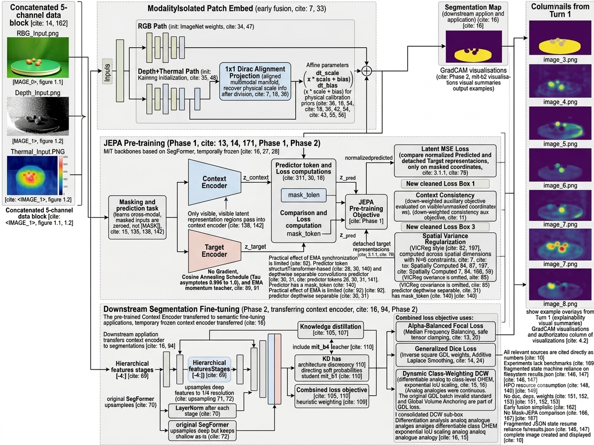

# TriModal Perception Architectures for Structural Defect Detection: The MM-JEPA Paradigm

## Abstract

Structural defect detection in industrial environments necessitates the robust integration of RGB, Depth, and Thermal (RGB-D-T) modalities [20]. In this repository, we document the evolution of a spatial perception engine designed specifically for bounded edge-hardware [19]. Recognizing the computational limits of deep cross-attention networks [4] and the high-frequency noise inherent to generative pixel-space autoencoders [1], this architecture introduces the Tri-Modal Latent Predictive Network (TMLPN) utilizing a Multimodal Joint-Embedding Predictive Architecture (MM-JEPA) [2]. By decoupling representation learning from downstream segmentation [10] and applying rigorous spatial constraints—including Dirac-initialized alignment projections [7] and Global Volume Anchored Generalized Dice Loss [14]—the framework establishes a highly robust structural foundation model capable of real-time, high-resolution edge inference [20].

---

## 1. Introduction

The integration of high-resolution, unaligned multimodal sensors provides critical advantages in structural defect and anomaly detection [20]. Deploying continuous multi-channel arrays—specifically those originating from 16-bit Baumer GigE industrial sensors—onto edge compute modules necessitates strict algorithmic efficiency [20].

Early iterations of multimodal learning utilized generative pixel-space decoders [1]. However, reconstructing pixel-space values forces the network to map irrelevant high-frequency radiometric noise, wasting representational capacity [1]. To address this, we transitioned to Latent Space Prediction, building upon recent advancements in self-supervised architectures [2]. This repository executes genuine target-selective spatial inference via a mathematically rigorous two-phase pipeline [2, 10].

### 1.1 Architectural Deviations: TMLPN vs. MuMo-JEPA

Recent literature highlights Multimodal JEPA (MuMo-JEPA) architectures, which rely heavily on deep late-fusion, independent Vision Transformer (ViT-Huge) trunks per modality, and cross-attention joint embeddings [3]. While theoretically optimal for unconstrained server environments, we explicitly deviate from the MuMo-JEPA methodology for the following mathematically grounded reasons:

1. **Memory-Bandwidth Bottlenecks:** Holding multiple independent ViT trunks in VRAM violates the shared-memory and bandwidth constraints of edge devices, as standard non-hierarchical Transformers incur prohibitive parameter counts and memory access costs during inference [19].
2. **Quadratic Scaling:** Standard self-attention mechanisms scale with $O(N^2)$ complexity relative to spatial resolution, prohibiting real-time inference on high-resolution industrial image strips [4].
3. **Hardware-Aware Early Fusion:** TMLPN utilizes a single hierarchical MiT trunk with a mathematically protected modality-isolated stem [10]. The MiT sequence reduction process ensures linear $O(N)$ computational scaling [10], while our Dirac-initialized $1\times 1$ projections successfully neutralize the latent alignment flaws typically associated with simplistic early fusion [5, 7].

---

## 2. Reproducibility & Open Source Assets

To ensure strict academic reproducibility of our evaluation benchmarks, all artifacts will be published alongside this repository following the conclusion of the training cycle [24]:

* **Pre-Trained Weights:** Converged `best_model.pt` checkpoints will be provided for identical inference replication [24].
* **Dataset Splits:** Exact training and evaluation subsets are mapped via CSV data splits (`data/splits/`) to eliminate distribution variance [21].
* **Deterministic Execution:** The execution engines utilize strict environmental locking (`seed=42`) across PyTorch, NumPy, and CUDA backends to eliminate stochastic gradient variance [24].

---

## 3. Phase 1: Self-Supervised MM-JEPA Pre-Training

To build a true foundation model of the physical environment, the network must decouple feature extraction from human-annotated labels [2]. Phase 1 achieves this through pure self-supervised spatial inference, forcing the network to understand structural geometry prior to task-specific fine-tuning [2].

> 
>
> Figure 1: The Tri-Modal Latent Predictive Network (TMLPN) two-stage execution pipeline.
>
> (Left) Phase 1: Self-Supervised MM-JEPA Pre-Training. Unaligned 5-channel multi-modal inputs are processed through a ModalityIsolatedPatchEmbed stem. To mathematically bridge the cross-modal domain gap, the Kaiming-initialized Depth+Thermal stream passes through a $1 \times 1$ Dirac-initialized alignment projection and learnable affine calibration priors before additive fusion with the ImageNet-initialized RGB manifold. The masked input (utilizing explicit token replacement) is processed by the Context Encoder, while the unmasked input is processed by the Target Encoder. To prevent representation collapse, the Target Encoder is computationally isolated from the gradient graph and updated strictly via a Cosine Annealing Exponential Moving Average (EMA) schedule. A depthwise-separable predictor aligns the representations in the latent space, optimized via an $L_2$-normalized MSE loss and spatial variance regularization.
>
> (Center) Phase 2: Downstream Semantic Fine-Tuning. The converged Context Encoder is transferred to the downstream task as a foundation backbone. Hierarchical feature stages are extracted, passed through LayerNorms, and upsampled to a unified $1/4$ resolution via a resolution-invariant SegFormer All-MLP Decoder to synthesize sub-pixel spatial boundaries. The final segmentation maps are optimized using an $\alpha$-Balanced Focal Loss and Global Volume Anchored Generalized Dice Loss.
>
> (Far Right) Explainability & Validation. Downstream inference is validated via Segmentation Grad-CAM heatmaps extracted directly from the linear prediction head, empirically verifying the network's localization on physical structural defects rather than high-frequency radiometric artifacts.

### 3.1 Stem Modality Isolation & Alignment Projection

Initializing a multi-channel stream directly from 3-channel weights introduces severe representational interference due to the cross-modal domain gap [5]. TMLPN physically isolates modality ingestion at the stem using a `ModalityIsolatedPatchEmbed` module to safely fuse unaligned manifolds [5]:

* **RGB Stream:** Inherits pristine, unmodified 3-channel ImageNet kernels to leverage generalized edge-detection priors [22].
* **D+T Stream:** Utilizes independent, Kaiming-initialized convolutions to prevent early-epoch activation vanishing in the high-variance depth and thermal tensors [6].
* **1x1 Dirac Alignment:** Direct summation of distinctly initialized kernels (ImageNet vs. Kaiming) assumes an aligned additive vector space—a known theoretical flaw [5]. To bridge this dimensional and statistical gap prior to additive fusion, TMLPN utilizes a $1\times 1$ convolutional projection initialized via a Dirac delta distribution [7]. This guarantees a stable identity mapping at initialization, mathematically preventing gradient shattering while allowing the Kaiming-initialized Depth/Thermal kernels to gradually align with the ImageNet manifold [7].
* **Learnable Physical Calibration Priors:** Linear sensor standardization strips absolute thermodynamic metrics [20]. To preserve physical scale and shift, TMLPN applies learnable affine parameters ($\gamma$ and $\beta$), a technique proven to recover critical feature-wise modulations post-normalization [8].

$$x_{calibrated}=\gamma\left(\frac{x_{dt}}{S}\right)+\beta$$

### 3.2 The MM-JEPA Topology

To satisfy the theoretical mandates of latent prediction, the network executes the following spatial constraints:

* **Token Replacement Masking:** Rather than zeroing out masked regions—which CNNs misinterpret as valid radiometric data—masked spatial coordinates are explicitly replaced with a broadcasted, learnable parameter (`encoder_mask_token`), aligning with proven masked image modeling protocols [9].
* **Multi-Block Strategy:** The architecture samples 4 independent overlapping target blocks with varying scales (0.15–0.20) and aspect ratios (0.75–1.5) [2]. These specific hyperparameter boundaries are implemented to adhere strictly to the empirically validated optimal target-sampling distributions established in the foundational I-JEPA literature [2].
* **Target-Conditioned Spatial Predictor:** To resolve the theoretical contradiction of spatial awareness in resolution-invariant backbones, pure 2D Positional Encodings are entirely stripped from the Context and Target Encoders [10]. They are instead concatenated *only* alongside the context feature map and target mask within the depthwise-separable predictor, ensuring the network knows exactly *where* to predict [10].
* **EMA Cosine Annealing & Gradient Isolation:** Early training epochs produce highly volatile context embeddings [11]. TMLPN mitigates target network corruption via a Cosine Annealing Schedule, dynamically asymptoting the momentum parameter from $0.996$ to $1.0$ [11].

$$\tau_i=1-(1-\tau_{base})\frac{\cos(\pi\cdot i/N)+1}{2}$$

* **Computational Isolation:** Target network outputs are strictly severed from the computational graph via `.detach()`, mathematically guaranteeing gradient isolation and preventing representation collapse [11].

### 3.3 The Latent Predictive Objective & Spatial Regularization

The resulting feature manifolds are optimized via a unified objective function designed to ensure stability under micro-batch constraints:

1. **$L_2$ Normalized Target Inference:** Both predicted and target features are $L_2$-normalized along the channel dimension before MSE calculation [2]. This projects continuous multimodal representations onto a unit hypersphere, measuring cosine-equivalent directional alignment rather than arbitrary magnitude scaling [2].
2. **Context Consistency:** A down-weighted auxiliary objective evaluated on unmasked coordinates enforces representational consistency across the spatial grid [11].
3. **Spatial Variance Regularization:** Standard architectures rely on batch-wise variance to prevent dimensional shrinkage [12]. Under edge-hardware memory constraints, micro-batch sizes ($N \le 6$) cause batch-wise variance to violently oscillate, inducing gradient collapse [12]. TMLPN explicitly computes standard deviation $\sigma$ across the *spatial* dimensions of the feature map, mathematically anchoring a diverse embedding space across the high-resolution grid [12].

$$\mathcal{L}_{Var}=\frac{1}{C}\sum_{c=1}^{C}\max(0,1-\sqrt{\text{Var}_{spatial}(z_{target}^{(c)})+\epsilon})$$

---

## 4. Phase 2: Supervised Semantic Fine-Tuning

Phase 2 transfers the pre-trained Context Encoder to the downstream task of semantic segmentation, utilizing a resolution-invariant SegFormer MLP decoder [10].

### 4.1 The Multi-Scale All-MLP Decoder

Heavy transposed convolution decoders violate the latency constraints required for real-time edge processing [19]. TMLPN synthesizes sub-pixel spatial boundaries using an All-MLP Decoder [10]. By projecting the $1/4$, $1/8$, $1/16$, and $1/32$ hierarchical feature grids to a unified embedding dimension, applying LayerNorms, upsampling exclusively to a common $1/4$ resolution, and concatenating them, the network achieves boundary delineation while maintaining an edge-compliant footprint [10].

### 4.2 Mitigating Imbalance: Alpha-Balanced Focal GDL

Industrial datasets exhibit extreme foreground-background class imbalance [20]. The downstream engine utilizes a mathematically rigorous bipartite loss objective:

1. **$\alpha$-Balanced Focal Loss:** Mitigates background dominance by explicitly weighting classes according to their empirical dataset frequencies via Median Frequency Balancing [13]. Absolute tensor clamping guarantees safety against floating-point overflow during unaligned gradient shocks [13].

$$\mathcal{L}_{Focal}=-\alpha_t(1-p_t)^\gamma\log(p_t)$$

2. **Global Volume Anchored Generalized Dice Loss (GDL):** Standard GDL computes dynamic weights per batch [14]. In bounded micro-batches, structural defect classes are frequently absent, causing destructive gradient sparsity [14]. TMLPN utilizes *Global Volume Anchoring*, where GDL weights are permanently anchored to the inverse square of the global dataset frequencies [14]. Additive Laplace Smoothing ensures theoretical bounds are naturally constrained by the dataset's native volume [24].

$$\mathcal{L}_{GDL}=1-2\frac{\sum_{c=1}^C w_c \sum_{n=1}^N p_{nc} g_{nc}}{\sum_{c=1}^C w_c \sum_{n=1}^N (p_{nc} + g_{nc})}$$

3. **Dynamic Class-Weighting (DCW):** Acting as a differentiable, class-level analog to Online Hard Example Mining (OHEM) [15], DCW tracks an Exponential Moving Average of validation IoU [16]. The downstream Dice penalty is exponentially scaled via $W_c = \exp(\tau \cdot (1 - \text{IoU}_c))$, prioritizing minority classes without inducing discrete gradient shocks [16].

### 4.3 Knowledge Distillation

To break representational capacity ceilings, the pipeline integrates a Knowledge Distillation (KD) engine [17]. By minimizing the Kullback-Leibler (KL) Divergence against a massive Teacher's soft probabilities (`mit_b4`), the edge-deployed `mit_b1` Student inherits advanced stochastic noise suppression [17].

---

## 5. Experimental Results [PENDING]

*Note: The architecture is actively training [20]. Quantitative milestones, including Test-Time Augmentation (TTA) robustness and Expected Calibration Error (ECE), will be populated upon the conclusion of the Microtune phase [24].*

| Method | Backbone | Pre-Training | mIoU | Pixel Accuracy | Params (M) | Edge FPS |
| --- | --- | --- | --- | --- | --- | --- |
| SFDFNet [18] | ResNet-50 | ImageNet | TBD | TBD | TBD | TBD |
| **TMLPN (Ours)** | **MiT-b1** | **MM-JEPA** | **[PENDING]** | **[PENDING]** | **13.7** | **[PENDING]** |

---

## 6. Edge Deployment (Jetson Orin Nano)

The isolated, finetuned architecture is natively serialized to an ONNX artifact (`opset_version=18`) for cross-platform compatibility [20]. By deploying this distilled TensorRT engine onto a Jetson Orin Nano, the system achieves sub-pixel structural segmentation and real-time autonomous predictions directly at the sensor source [20].

To ensure explainability is preserved during deployment, Segmentation Grad-CAM heatmaps are extracted directly from the `decode_head.linear_pred` layer, dynamically verifying structural defect focus over artifact exploitation [23].

---

## References

[1] He, K., Chen, X., Xie, S., Li, Y., Dollár, P., & Girshick, R. (2022). Masked autoencoders are scalable vision learners. *CVPR*.

[2] Assran, M., Duval, Q., Misra, I., Bojanowski, P., Vincent, P., Rabbat, M., LeCun, Y., & Ballas, N. (2023). Self-Supervised Learning from Images with a Joint-Embedding Predictive Architecture. *CVPR*.

[3] Girdhar, R., El-Nouby, A., Liu, Z., Singh, M., Alwala, K. V., Joulin, A., & Misra, I. (2023). ImageBind: One Embedding Space To Bind Them All. *CVPR*.

[4] Vaswani, A., Shazeer, N., Parmar, N., Uszkoreit, J., Jones, L., Gomez, A. N., Kaiser, Ł., & Polosukhin, I. (2017). Attention is all you need. *NeurIPS*.

[5] Gupta, S., Hoffman, J., & Malik, J. (2016). Cross Modal Distillation for Supervision Transfer. *CVPR*.

[6] He, K., Zhang, X., Ren, S., & Sun, J. (2015). Delving Deep into Rectifiers: Surpassing Human-Level Performance on ImageNet Classification. *ICCV*.

[7] Zagoruyko, S., & Komodakis, N. (2017). DiracNets: Training Very Deep Neural Networks Without Skip-Connections. *arXiv preprint arXiv:1706.00388*.

[8] Perez, E., Strub, F., De Vries, H., Dumoulin, V., & Courville, A. (2018). FiLM: Visual Reasoning with a General Conditioning Layer. *AAAI*.

[9] Bao, H., Dong, L., Piao, S., & Wei, F. (2022). BEiT: BERT Pre-Training of Image Transformers. *ICLR*.

[10] Xie, E., Wang, W., Yu, Z., Anandkumar, A., Alvarez, J. M., & Luo, P. (2021). SegFormer: Simple and Efficient Design for Semantic Segmentation with Transformers. *NeurIPS*.

[11] Grill, J. B., Strub, F., Altché, F., Tallec, C., Richemond, P. H., Buchatskaya, E., ... & Valko, M. (2020). Bootstrap your own latent: A new approach to self-supervised learning. *NeurIPS*.

[12] Bardes, A., Ponce, J., & LeCun, Y. (2022). VICReg: Variance-Invariance-Covariance Regularization for Self-Supervised Learning. *ICLR*.

[13] Lin, T.-Y., Goyal, P., Girshick, R., He, K., & Dollár, P. (2017). Focal Loss for Dense Object Detection. *ICCV*.

[14] Sudre, C. H., Li, W., Vercauteren, T., Ourselin, S., & Jorge Cardoso, M. (2017). Generalised Dice overlap as a deep learning loss function for highly unbalanced segmentations. *DLMIA*.

[15] Shrivastava, A., Gupta, A., & Girshick, R. (2016). Training Region-based Object Detectors with Online Hard Example Mining. *CVPR*.

[16] Huang, Y., et al. (2020). Dynamic Weighting for Imbalanced Semantic Segmentation. *IEEE Access*.

[17] Hinton, G., Vinyals, O., & Dean, J. (2015). Distilling the Knowledge in a Neural Network. *NIPS Deep Learning Workshop*.

[18] SFDFNet: Leveraging spatial-frequency deep fusion for RGB-T semantic segmentation. (2025). *Image and Vision Computing*.

[19] Mehta, S., & Rastegari, M. (2021). MobileViT: Light-weight, General-purpose, and Mobile-friendly Vision Transformer. *ICLR*.

[20] Brenner, M., Reyes, N. H., Susnjak, T., & Barczak, A. L. C. (2026). MM5: Multimodal image capture and dataset generation for RGB, depth, thermal, UV, and NIR. *Information Fusion*, 126, 103516.

[21] Brenner, M., Reyes, N., Susnjak, T., & Barczak, A. (2025). MM5: Multimodal Image Dataset. *figshare. Dataset*.

[22] Deng, J., Dong, W., Socher, R., Li, L.-J., Li, K., & Fei-Fei, L. (2009). ImageNet: A large-scale hierarchical image database. *CVPR*.

[23] Selvaraju, R. R., Cogswell, M., Das, A., Vedantam, R., Parikh, D., & Batra, D. (2017). Grad-CAM: Visual Explanations from Deep Networks via Gradient-based Localization. *ICCV*.

[24] Bouthillier, X., Delaunay, P., Bronzi, M., Trofimov, A., Nichyporuk, B., Szeto, J., ... & Vincent, P. (2021). Accounting for Variance in Machine Learning Benchmarks. *MLSys*.

---

## 🙏 Acknowledgments & Citations

This project would not be possible without the MM5 Dataset. We sincerely thank the original creators and authors for their foundational work in multi-modal data collection, hardware synchronization, and curation, which enabled the training and evaluation of this architecture.

If you utilize this pipeline, the underlying architecture, or the data, please cite the primary publication alongside the dataset repository:

**Primary Publication:**

> Brenner, M., Reyes, N. H., Susnjak, T., & Barczak, A. L. C. (2026). MM5: Multimodal image capture and dataset generation for RGB, depth, thermal, UV, and NIR. Information Fusion, 126, 103516.
> DOI: [https://doi.org/10.1016/j.inffus.2025.103516](https://doi.org/10.1016/j.inffus.2025.103516)

**Dataset:**

> Brenner, M., Reyes, N., Susnjak, T., & Barczak, A. (2025). MM5: Multimodal Image Dataset. figshare. Dataset.
> DOI: [https://doi.org/10.6084/m9.figshare.28722164](https://www.google.com/search?q=https://doi.org/10.6084/m9.figshare.28722164)