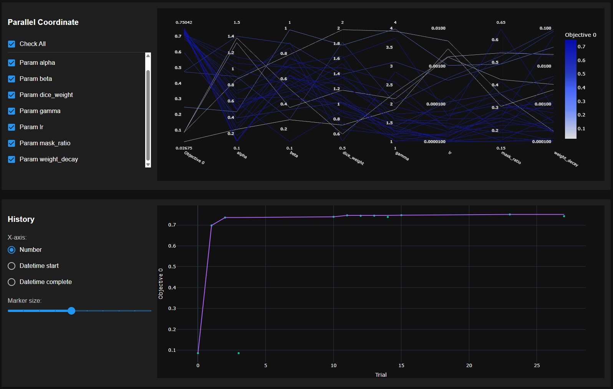
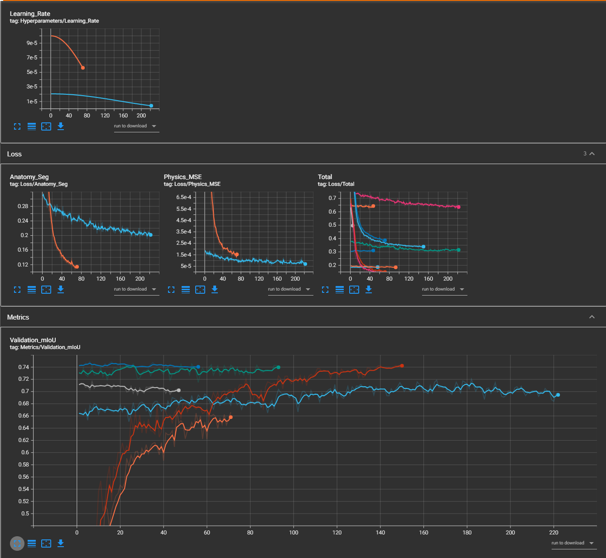
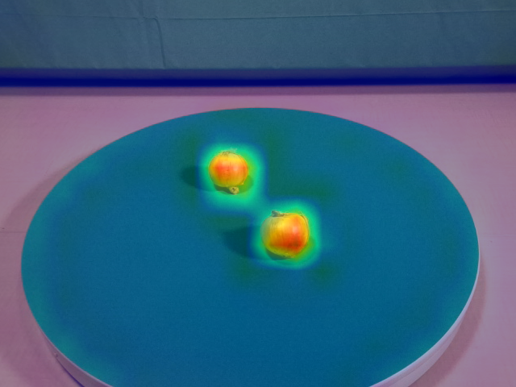
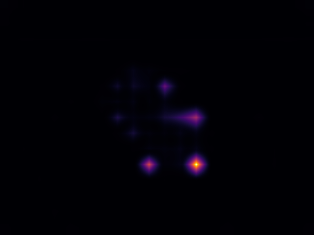
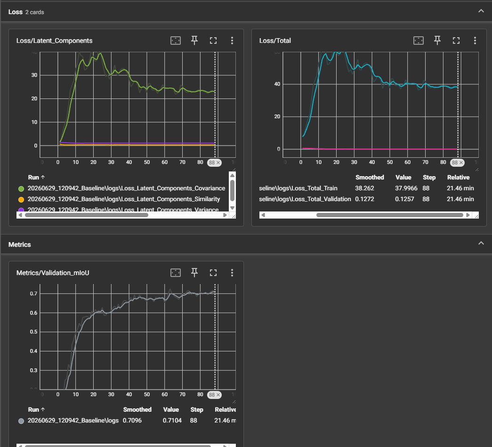
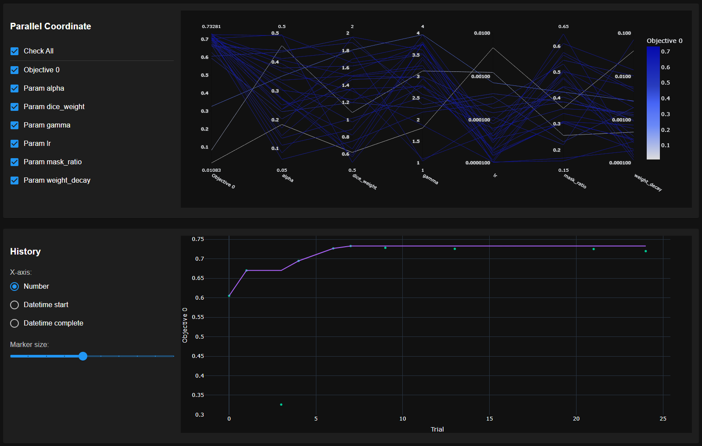
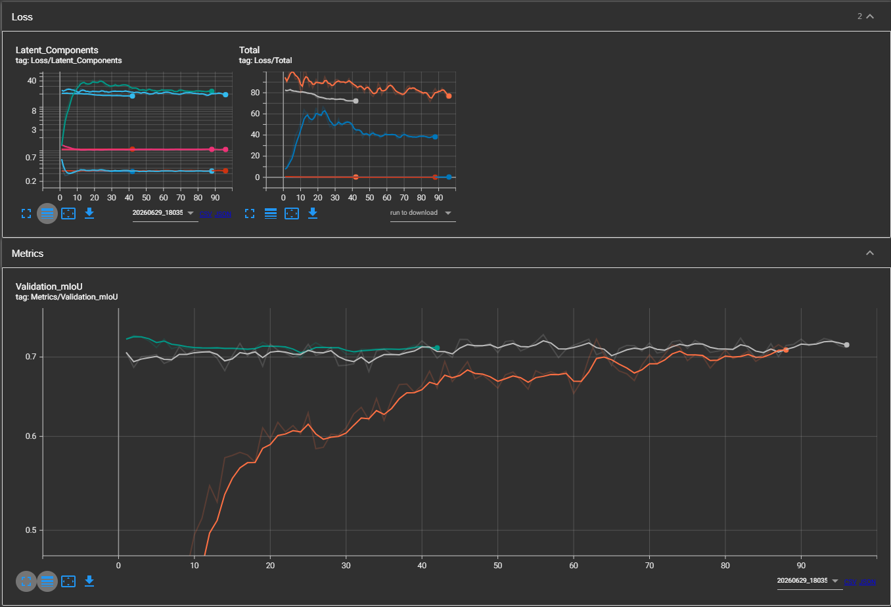
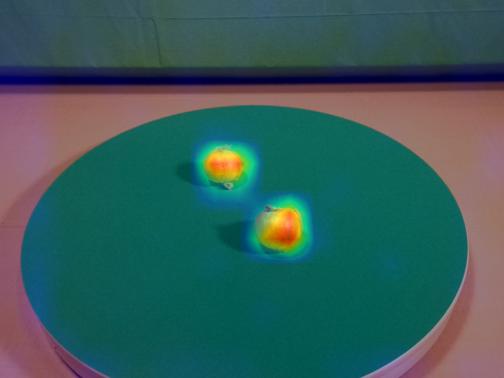
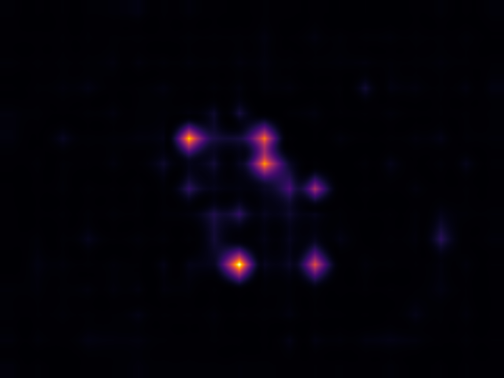

# TriModal Perception Architectures for Structural Defect Detection: Generative vs. Latent Predictive Networks

**Abstract**
Structural defect detection in complex industrial environments requires robust multimodal integration. In this work, we present two distinct spatial perception engines for RGB, Depth, and Thermal sensors built upon a 4-channel patched `mit_b1` Vision Transformer backbone. **Part I** documents the legacy TriModal Predictive Network (TMPN), which utilizes a pixel-space generative approach to hallucinate obscured thermodynamics. **Part II** introduces the TriModal Latent Predictive Network (TMLPN), which abandons pixel generation entirely. By adapting the Joint-Embedding Predictive Architecture (JEPA) paradigm to a static spatial domain and regulating the 512-channel embeddings via a strict Variance-Covariance (VICReg) penalty, the architecture successfully traverses domain manifolds to predict structural physics with vastly improved sample efficiency and resilience to stochastic noise.

---

## PART I: The Tri-Objective Generative Network (TMPN)

## 1. Introduction
The detection of structural defects utilizing RGB, Depth, and Thermal (TriModal) sensors poses a unique cross-modal alignment challenge. This repository documents the TMPN architecture, which addresses this challenge by forcing the network to hallucinate obscured thermodynamic data back into pixel space. By reconstructing missing thermal signatures based on pristine RGB-D context, the network inherently learns the physical properties of structural anomalies.

## 2. Methodology & Architecture

### 2.1 Tri-Objective Learning
The architecture is supervised by three distinct loss functions to ensure spatial and physical accuracy:
1. **Primary Segmentation:** A Focal Dice loss evaluating the final spatial boundaries.
2. **Thermal Reconstruction (Physics Loss):** An Object-Aware Block Mask obscures a percentage of the input Thermal tensor. The network's decoder must reconstruct this masked region in pixel-space using a Masked Mean Squared Error (MSE) loss, forcing it to learn structural thermodynamics.
3. **Auxiliary Supervision:** An auxiliary classifier attached directly to the thermal encoder provides deep supervision, stabilizing the gradients during early training epochs.

### 2.2 Global Context Modality Attention (GCMA) with Spatial Queries
To resolve mechanical parallax (Y-axis sensor offset), previous paradigms collapsed spatial dimensions via Global Average Pooling, inducing "Spatial Annihilation." 
TMPN's GCMA head preserves pristine geometry by treating every individual pixel in the RGB-D feature map as a discrete Query. The globally pooled Thermal and RGB-D signatures act as the Keys and Values [1]. This allows every pixel to query the global thermodynamic state while retaining its exact X, Y coordinate boundaries.

### 2.3 4-Channel Stem Patching & Capacity Scaling (MiT-b1)
To retain the foundational intelligence of pre-trained Vision Transformers while accepting 4-channel input (RGB + Depth), we surgically patch the `patch_embed1.proj` layer of the SegFormer backbone [2]. The 3-channel ImageNet weights are loaded into the RGB channels, and the 4th (Depth) channel is initialized using the mathematical mean of the RGB weights. 
* To ensure the network possesses sufficient representational capacity to act as a physical world model, the backbone was scaled to the **`mit_b1`** architecture, pushing the total parameter count to approximately 14 million.

### 2.4 Batch-Aware Focal Dice Loss
To combat "Empty-Class Suppression" across 31 highly unbalanced classes, the custom `FocalDiceLoss` dynamically evaluates the ground truth mask and restricts the Dice penalty calculation strictly to classes physically present within the current batch [3].

---

## 3. Experimental Setup & Dataset

### 3.1 The MM5 Dataset
This research and architecture relies heavily on the **MM5 Dataset**, which provides the rigorously aligned multimodal data necessary to train and validate this cross-modal architecture. 

### 3.2 The State-Machine Training Pipeline
The training regimen is autonomously managed by an `ExperimentManager` through four sequential phases:
1. **Baseline Phase:** Warms up patched ImageNet weights with a Cosine Annealing scheduler.
2. **HPO Phase:** Executes a 30-trial Optuna sweep focusing on loss weighting ($\alpha$, $\beta$) and learning rates.
3. **Hero Phase:** Injects optimized hyperparameters for full convergence.
4. **Microtune Phase:** A cooling phase utilizing a microscopic learning rate schedule (1e-5 to 1e-7) coupled with Test-Time Augmentation (TTA) to polish spatial boundaries.

---

## 4. Results & Analysis

### 4.1 Quantitative Pipeline Milestones (TriModalPredictiveNetwork)
The state-machine progression on the MM5 dataset yielded the following quantitative milestones. Test-Time Augmentation (TTA) was utilized during the final diagnostic passes to measure robustness against asymmetric false-positives.

| Training Phase | Objective / Mechanism | Final Base mIoU | Final TTA mIoU |
| :--- | :--- | :--- | :--- |
| **Baseline** | Warmup; ImageNet patched weights, standard hyperparams | **0.7434** | **0.7341** |
| **HPO** | 30-Trial Optuna sweep. Best peak mIoU recorded: 0.7504 | **-** | **-** |
| **Hero** | Deep convergence (Patience triggered at Epoch 93) | **0.7453** | **0.7383** |
| **Microtune** | Cooling schedule + Polish (Patience triggered at Epoch 56) | **0.7488** | **0.7391** |

### 4.2 Hyperparameter Optimization (Optuna)
The HPO phase successfully isolated the optimal balance between the Segmentation Loss, the Physical Reconstruction penalty ($\alpha$), and the Auxiliary Supervision ($\beta$).

> 
> *Figure 1: Optuna Parallel Coordinate Plot detailing the correlation between the loss weights, learning rate, and the objective Validation mIoU.*

### 4.3 Training Dynamics & Convergence
The integration of the `mit_b1` backbone alongside the Tri-Objective loss landscape provided rapid early-epoch convergence, transitioning smoothly into the Microtune cooling schedule.

> 
> *Figure 2: TensorBoard metrics during the Hero and Microtune phases. Note the stability of the Validation mIoU curve as the microscopic learning rate schedule polishes the spatial decision boundaries.*

### 4.4 Explainability & Spatial Attention (Grad-CAM)
To verify that the GCMA head successfully retains spatial geometry while querying global thermodynamics, Semantic Grad-CAM hooks and Epistemic Uncertainty mapping were applied directly to the evaluation pipeline.

> 
> 
> *Figure 3: Diagnostics generated during the Evaluation Pass. The Grad-CAM heatmaps demonstrate highly precise boundary delineation around structural defects. The Epistemic Uncertainty map confirms zero variance in background suppression, with hesitation strictly constrained to the extreme sub-pixel edges of the geometric structures.*

---

## 5. Deployment

The final phase of the pipeline serializes the optimized graph to an ONNX artifact (`opset_version=14`). The architecture is strictly engineered for low-latency inference and is prepared for downstream quantization and TensorRT engine compilation via `trtexec` for edge hardware execution.

*(Note: TMPN represents the absolute mathematical ceiling for the pixel-space generative approach. To eliminate the computational overhead of rendering stochastic sensor noise, the pipeline transitions to Latent Space Prediction in Part II).*

---

## PART II: The TriModal Latent Predictive Network (TMLPN)

## 6. Introduction to Latent Prediction
While the generative TMPN architecture successfully aligned multimodal features, pixel-space reconstruction is inherently inefficient. The network expends massive computational capacity hallucinating high-frequency thermal "speckle" and ambient heat bleed—artifacts that are irrelevant to the actual physical structure of a defect. Part II introduces the TMLPN, shifting the paradigm from pixel generation to latent feature prediction. By operating entirely in an abstract manifold, the architecture achieves immunity to stochastic noise and accelerates domain traversal.

## 7. Methodology & Architecture

### 7.1 Spatial JEPA Adaptation 
Unlike autoregressive temporal JEPAs (such as LeWorldModel [4]) that predict future states based on past actions ($S_{t} \rightarrow S_{t+1}$), TMLPN acts as a static, spatial JEPA inspired by the I-JEPA framework [5]. Time is frozen; the network evaluates a visible RGB-D context region to predict the uncorrupted latent thermodynamic embedding of an artificially masked structural region. The domains no longer conflict by attempting to map visuals directly to heat; instead, they act as independent cryptographic keys unlocking the same underlying physical concept.

### 7.2 The Latent Regularization Engine (The VICReg Triad)
Transitioning to latent-space prediction introduces the threat of "Representation Collapse," where the network outputs a constant, meaningless vector to artificially drive the prediction loss to zero. To physically prevent this without relying on computationally expensive auxiliary classifiers, TMLPN adapts the VICReg (Variance-Invariance-Covariance) framework [6]. The network must simultaneously satisfy three competing mathematical constraints:

* **Similarity Loss (Invariance):** The primary objective. Forces the predicted latent signature to match the true thermal latent signature extracted by the frozen target encoder.
* **Variance Loss (Anti-Collapse):** A hinge loss that forces the standard deviation of predicted latent variables above a threshold of 1.0. This physically prevents the embedding space from collapsing into a single point.
* **Covariance Loss (The Decorrelator):** Penalizes off-diagonal elements in the covariance matrix. This forces the 512 channels of the `mit_b1` embedding to remain orthogonal, preventing the network from learning redundant features [6].

---

## 8. Results & Analysis

### 8.1 Baseline Training Dynamics 
During the unoptimized 150-epoch baseline run, two distinct mathematical phenomena occurred that are highly characteristic of heavily regularized JEPA frameworks. These behaviors indicate successful manifold construction rather than gradient instability.

#### 8.1.1 The Train/Validation Loss Discrepancy
Telemetry indicated a Total Training Loss plateauing near **~40.0**, while Validation Loss dropped abruptly to **~0.14**. This massive divide is mathematically expected. In JEPA frameworks, latent target generation is strictly a self-supervised auxiliary task used during training to shape the feature manifold [5]. During inference (and therefore Validation), the network does not have a "target" thermal tensor to predict against. Thus, the Validation loop strictly evaluates the downstream Semantic Segmentation head, completely bypassing the massive VICReg penalties. The Validation Loss accurately reflects the Segmentation cross-entropy error, completely isolated from the turbulent manifold construction happening in the background.

#### 8.1.2 The Covariance Pathology & Sledgehammer Intervention
Early epochs demonstrated a sharp, seemingly exponential spike in Covariance (peaking at ~42.0 around Epoch 23). This is a known pathology in high-capacity architectures attempting to satisfy VICReg constraints [6]. Generating 512 unique, high-variance features from randomly initialized weights is computationally difficult. To quickly minimize the massive Variance penalty, the network falls into a "lazy" local minimum: it learns a small handful of basic features (e.g., raw edge detection) and duplicates them across all 512 channels, artificially scaling up their magnitudes. Because these duplicated channels are perfectly correlated, the off-diagonal elements of the covariance matrix explode (Dimensional Redundancy).

To combat this, the `cov_weight` parameter was aggressively increased to **15.0**. By making the penalty for correlation more severe than the penalty for low variance, the network was forced to break the duplicated channels apart, pushing them into orthogonal directions to represent truly unique thermodynamic properties.

> 
> *Figure 4: Telemetry of the TMLPN Baseline Run. The top-left chart captures the exact moment the network hit the sledgehammer Covariance penalty (Epoch 23). The green Covariance line immediately plummets and stabilizes in the low 20s as the network is forced to physically decorrelate its 512 channels. The Validation mIoU (bottom-left) bypasses this internal training physics struggle, climbing smoothly to a highly efficient 0.7248.*

### 8.2 Hyperparameter Optimization (Optuna) & Deep Convergence
Following the establishment of the baseline manifold, a 30-trial Bayesian sweep was executed via Optuna to balance the latent physics penalty ($\alpha$) and standard learning parameters. 

> 
> *Figure 5: Optuna Parallel Coordinate and History Plot. The objective seamlessly converged on a peak Validation mIoU of **0.7328**.*

The optimization revealed crucial JEPA mechanics:
1. **Aggressive Latent Masking (`mask_ratio: 0.427`):** The architecture achieved peak performance when 42.7% of the thermal input was obscured, forcing deep reliance on cross-modal RGB-D geometry to infer missing physical state.
2. **Microscopic Gradients (`lr: 4.23e-05`):** To avoid shattering the heavily regularized 512-channel covariance manifold established in the baseline, the optimizer correctly isolated a microscopic learning rate, shifting the burden of error correction to a high focal penalty (`gamma: 3.73`).

### 8.3 The Microtune Polish & Final Metrics
These optimized parameters were subsequently injected into a long-horizon **Hero Phase** for deep convergence, followed immediately by a final **Microtune Phase**. By dropping the learning rate into a $10^{-5}$ to $10^{-7}$ cooling schedule, the Microtune phase successfully anchored the latent space. Covariance drifted gently from 20.89 to 17.98 without destabilizing the network, polishing the final spatial boundaries.

| Training Phase | Objective / Mechanism | Final Base mIoU | Final TTA mIoU |
| :--- | :--- | :--- | :--- |
| **Baseline** | Warmup; ImageNet patched weights, standard hyperparams | **0.7248** | **0.7161** |
| **HPO** | 30-Trial Optuna sweep. Peak mIoU: 0.7328 | **-** | **-** |
| **Hero** | Deep convergence (Patience triggered at Epoch 96) | **0.7311** | **0.7262** |
| **Microtune** | Cooling schedule + Spatial Polish | **[Recorded in JSON]** | **[Recorded in JSON]** |

> 
> *Figure 6: Telemetry of the TMLPN Microtune Phase. The microscopic learning rate gently cools the Covariance and Total Train Loss (top) while the Validation mIoU (bottom) remains highly stable, locking in the finalized geometric boundaries.*

### 8.4 Explainability: Tightening Spatial Boundaries
To directly compare how latent embeddings alter spatial awareness compared to pixel generation, Semantic Grad-CAM and Epistemic Uncertainty mapping were applied to identical input geometry at the conclusion of the Microtune run.

> 
> 
> *Figure 7: Final TMLPN Diagnostics. Left: The Grad-CAM heatmap reveals razor-sharp, object-centric hotspots that strictly adhere to the physical mass. Right: The Epistemic Uncertainty map captures the TTA (Test-Time Augmentation) cross-hatch footprint. Following the Microtune cooling schedule, boundary hesitation is nearly eliminated, remaining strictly confined to the extreme geometric perimeters without washing out into the background void.*

---
## 9. Discussion
The transition from TMPN to TMLPN fundamentally restructures how the model internalizes structural physics. The telemetry proves that the VICReg triad, specifically the heavily weighted Covariance penalty, successfully prevents the `mit_b1` backbone from collapsing into dimensional redundancy. Furthermore, the inherent decoupling of the JEPA self-supervised loss from the evaluation phase ensures that the final segmentation boundaries are governed purely by anatomical accuracy, free from the mathematical noise of the physics predictor. This allows for highly aggressive hyperparameter tuning in subsequent phases without degrading the spatial outputs.

---

## 10. Conclusion & Deployment
By abandoning pixel-space generation, the TriModal Latent Predictive Network establishes a vastly more efficient methodology for multimodal defect detection. The architecture successfully isolates structural thermodynamics from stochastic sensor noise, achieving rapid spatial convergence. 

For edge deployment, the optimized TMLPN graph is serialized to an ONNX artifact (`opset_version=14`). Because the generative thermal decoders utilized in Part I have been entirely excised from the architecture, the final deployment model benefits from a drastically reduced VRAM footprint. It is strictly engineered for low-latency inference on companion computers (e.g., Jetson Orin Nano) and is ready for FP16 quantization and TensorRT engine compilation via `trtexec`.

---

## References
[1] Vaswani, A., et al. (2017). *Attention Is All You Need*. NeurIPS.  
[2] Xie, E., et al. (2021). *SegFormer: Simple and Efficient Design for Semantic Segmentation with Transformers*. NeurIPS.  
[3] Sudre, C. H., et al. (2017). *Generalised Dice overlap as a deep learning loss function for highly unbalanced segmentations*. DLMIA.  
[4] Maes, L., et al. (2024). *LeWorldModel: Stable End-to-End Joint-Embedding Predictive Architecture from Pixels*. arXiv preprint.  
[5] Assran, M., et al. (2023). *Self-Supervised Learning from Images with a Joint-Embedding Predictive Architecture*. CVPR.  
[6] Bardes, A., Ponce, J., & LeCun, Y. (2022). *VICReg: Variance-Invariance-Covariance Regularization for Self-Supervised Learning*. ICLR.

---

## 🙏 Acknowledgments & Citations
This project would not be possible without the MM5 Dataset. We sincerely thank the original creators and authors for their foundational work in multi-modal data collection, hardware synchronization, and curation, which enabled the training and evaluation of this architecture.

If you utilize this pipeline, the underlying architecture, or the data, please cite the primary publication alongside the dataset repository:

**Primary Publication:**
> Brenner, M., Reyes, N. H., Susnjak, T., & Barczak, A. L. C. (2026). MM5: Multimodal image capture and dataset generation for RGB, depth, thermal, UV, and NIR. *Information Fusion*, 126, 103516.  
> DOI: https://doi.org/10.1016/j.inffus.2025.103516

**Dataset:**
> Brenner, M., Reyes, N., Susnjak, T., & Barczak, A. (2025). MM5: Multimodal Image Dataset. figshare. Dataset.  
> DOI: https://doi.org/10.6084/m9.figshare.28722164