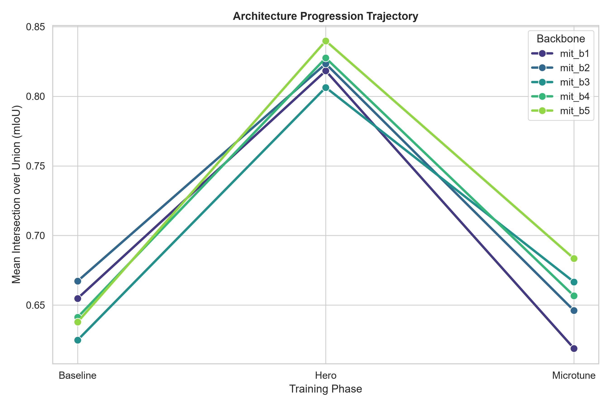
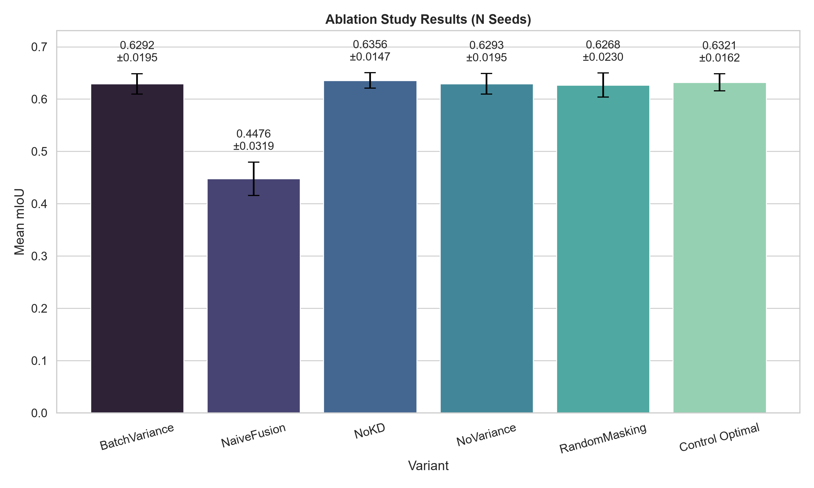
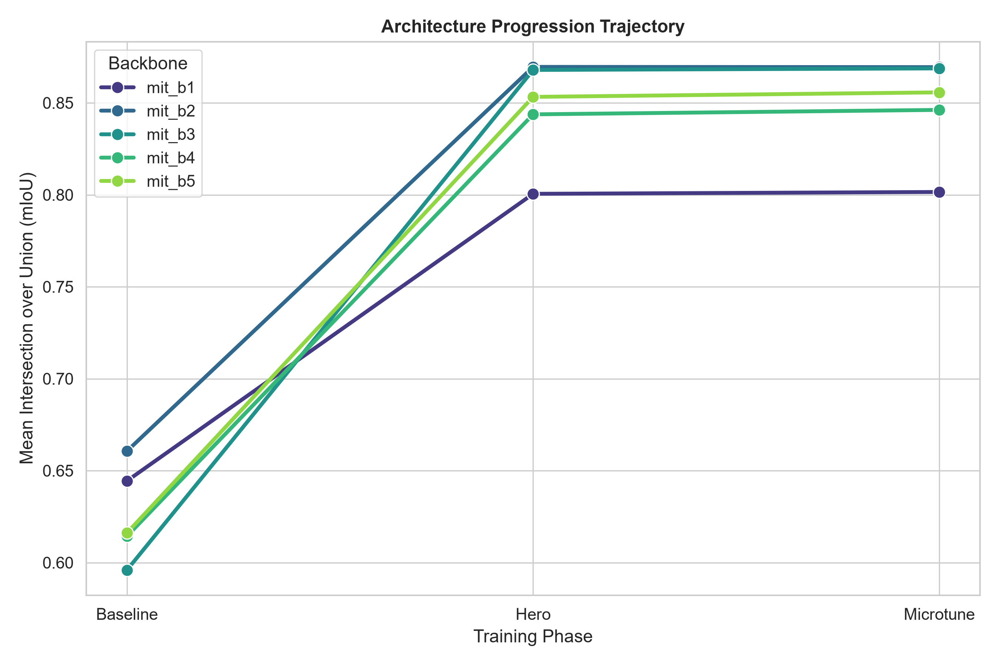
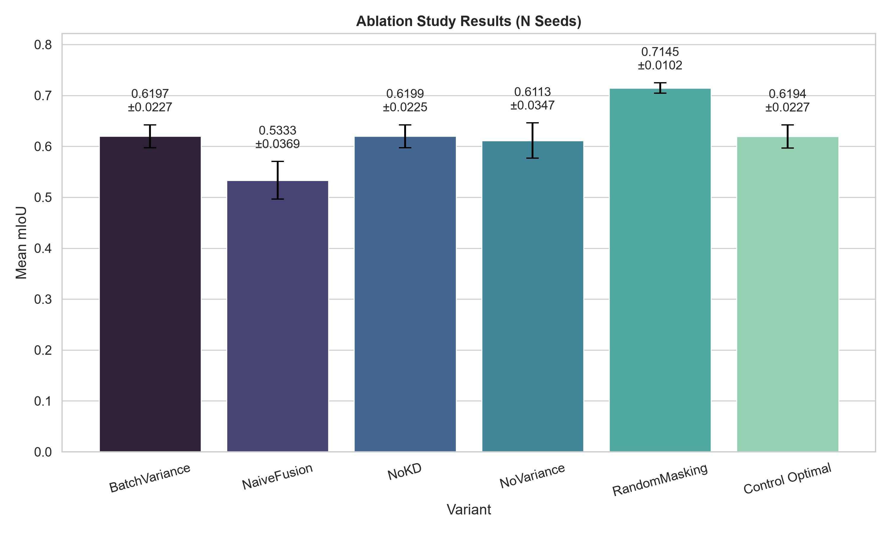
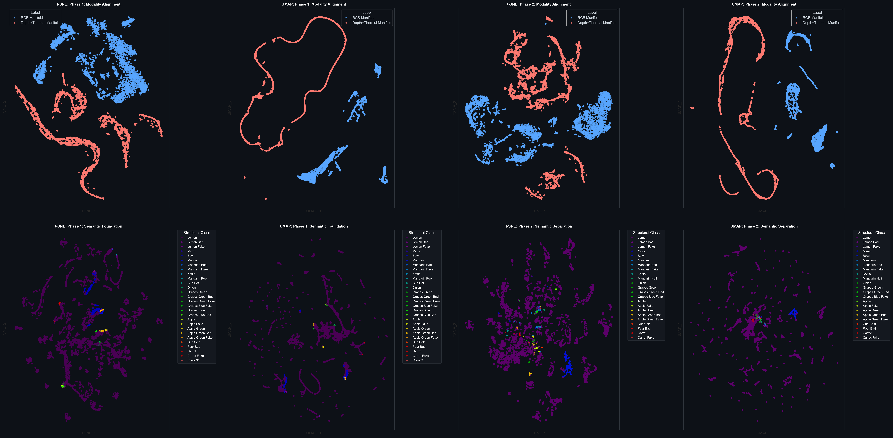
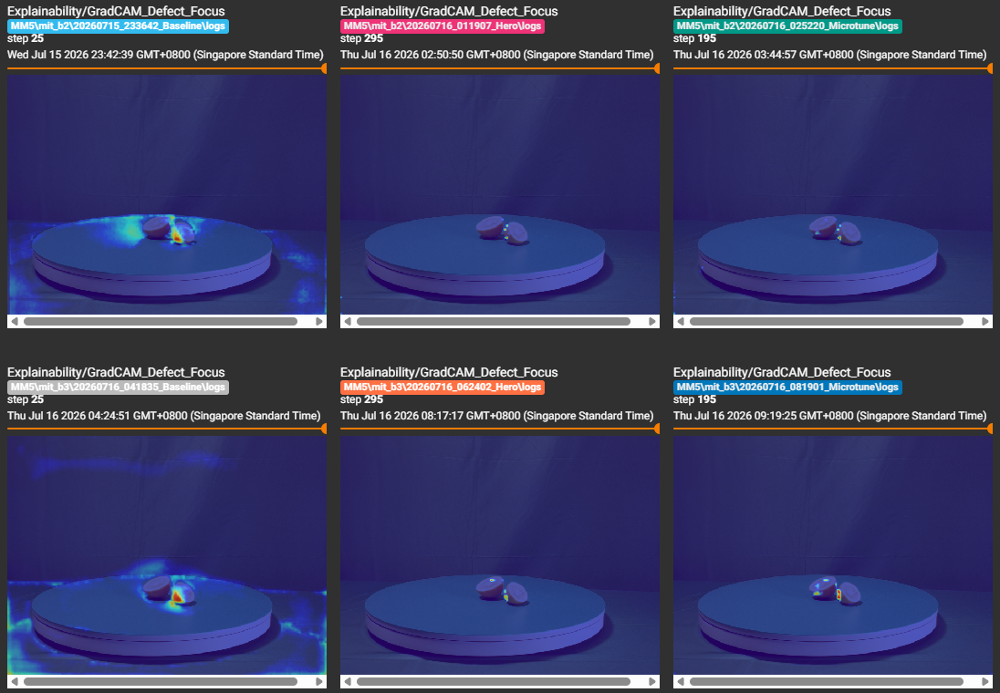

# TriModal Perception Architectures for Structural Defect Detection: The MM-JEPA Paradigm

## Abstract

Structural defect detection in industrial environments necessitates the robust integration of RGB, Depth, and Thermal (RGB-D-T) modalities [20]. In this repository, we document the evolution of a spatial perception engine designed specifically for bounded edge-hardware [19]. Recognizing the computational limits of deep cross-attention networks [4] and the high-frequency noise inherent to generative pixel-space autoencoders [1], this architecture introduces the Tri-Modal Latent Predictive Network (TMLPN_v3) utilizing a Multimodal Joint-Embedding Predictive Architecture (MM-JEPA) [2]. By decoupling representation learning from downstream segmentation [10] and applying rigorous spatial constraints—including Dirac-initialized alignment projections [7], Concurrent Spatial-Channel Gating [32], and Explicit Boundary Supervision [35]—the framework establishes a robust structural foundation model capable of real-time, high-resolution edge inference [20].

---

## 1. Introduction

The integration of high-resolution, unaligned multimodal sensors provides critical advantages in detecting structural defects and organic anomalies [20]. Deploying continuous multi-channel arrays—specifically utilizing Nuwa HP60C RGBD and 640x512 LWIR Vanadium Oxide fused sensor systems—onto edge compute modules necessitates strict algorithmic efficiency [20].

Early iterations of multimodal learning utilized generative pixel-space decoders [1]. However, reconstructing pixel-space values forces the network to map irrelevant high-frequency radiometric noise, reducing available representational capacity [1]. To address this, we transitioned to Latent Space Prediction, building upon recent advancements in self-supervised architectures [2]. This repository executes target-selective spatial inference via an empirically evaluated two-phase pipeline [2, 10].

### 1.1 Architectural Deviations: TMLPN vs. MuMo-JEPA

Recent literature highlights Multimodal JEPA (MuMo-JEPA) architectures, which rely on late-fusion, independent Vision Transformer (ViT-Huge) trunks per modality, and cross-attention joint embeddings [3]. While theoretically optimal for unconstrained server environments, we deviate from the MuMo-JEPA methodology for the following grounded reasons:

1. **Memory-Bandwidth Bottlenecks:** Maintaining multiple independent ViT trunks in VRAM violates the shared-memory and bandwidth constraints of edge devices, as standard non-hierarchical Transformers incur prohibitive parameter counts during inference [19].
2. **Quadratic Scaling:** Standard self-attention mechanisms scale with $O(N^2)$ complexity relative to spatial resolution, prohibiting real-time inference on high-resolution industrial image strips [4].
3. **Hardware-Aware Early Fusion:** TMLPN utilizes a single hierarchical MiT trunk with a structurally isolated modality stem [10]. The MiT sequence reduction process ensures linear $O(N)$ computational scaling [10], while our Dirac-initialized 1x1 projections address the latent alignment discrepancies typically associated with early fusion [5, 7].

---

## 2. Reproducibility & Open Source Assets

To ensure strict academic reproducibility of our evaluation benchmarks, all artifacts will be published alongside this repository following the conclusion of the training cycle [24]:

* **Pre-Trained Weights:** Converged `best_model.pt` checkpoints will be provided for identical inference replication [24].
* **Dataset Splits & Blind Testing:** Exact training and evaluation subsets are mapped via CSV data splits (`data/splits/`) to eliminate distribution variance [21]. To correct statistical inference and address validation leakage, the framework employs a strictly separated blind test set. The original evaluation pool is programmatically split into a 50% validation set (used strictly for hyperparameter sweep monitoring and early stopping) and a 50% test set reserved exclusively for final gradient-free metrics generation.
* **Deterministic Execution & Multi-Seed Verification:** The execution engines utilize strict environmental locking (`seed=42`) across PyTorch, NumPy, and CUDA backends to minimize stochastic gradient variance [24]. To eliminate single-run optimistic bias, all main architectural baselines and ablation experiments output multi-seed main results (N=5) to capture the Mean mIoU ± Standard Deviation.

---

## 3. Phase 1: Self-Supervised MM-JEPA Pre-Training

To construct a foundation model of the physical environment, the network must decouple feature extraction from human-annotated labels [2]. Phase 1 achieves this through self-supervised spatial inference, forcing the network to model structural geometry prior to task-specific fine-tuning [2].

### 3.1 Stem Modality Isolation & Alignment Projection

Initializing a multi-channel stream directly from 3-channel weights introduces representational interference due to the cross-modal domain gap [5]. TMLPN isolates modality ingestion at the stem using a `ModalityIsolatedPatchEmbed` module to safely fuse unaligned manifolds [5]:

* **RGB Stream:** Inherits unmodified 3-channel ImageNet kernels to leverage generalized edge-detection priors [22].
* **D+T Stream:** Utilizes independent, Kaiming-initialized convolutions to prevent early-epoch activation vanishing in the high-variance depth and thermal tensors [6].
* **1x1 Dirac Alignment:** To bridge this dimensional gap prior to additive fusion, TMLPN utilizes a 1x1 convolutional projection initialized via a Dirac delta distribution [7]: 

$$ W_{i,j,k,l} = \begin{cases} 1 & \text{if } i=j \text{ and } k,l \text{ are the center} \\ 0 & \text{otherwise} \end{cases} $$

This initialization provides a structural identity mapping that mitigates initial gradient shocks, allowing the Kaiming-initialized Depth/Thermal kernels to gradually assimilate into the pre-trained ImageNet manifold without corrupting the learned weights [7].

### 3.2 The MM-JEPA Topology

To satisfy the theoretical mandates of latent prediction, the network executes the following spatial constraints:

* **Token Replacement Masking:** Masked spatial coordinates are explicitly replaced with a broadcasted, learnable parameter (`encoder_mask_token`), aligning with proven masked image modeling protocols [1, 9].
* **Multi-Block Strategy:** The architecture samples 4 independent overlapping target blocks with varying scales (0.15–0.20) and aspect ratios (0.75–1.5) [2].
* **Target-Conditioned Spatial Predictor:** 2D Positional Encodings are concatenated strictly alongside the context feature map and target mask within the depthwise-separable predictor, ensuring the network is conditioned on the target location [10].
* **EMA Cosine Annealing & Gradient Isolation:** Target network outputs are severed from the computational graph and updated strictly via a Cosine Annealing Exponential Moving Average (EMA) schedule from 0.996 to 1.0 to prevent representation collapse [11].

---

## 4. Phase 2: Supervised Semantic Fine-Tuning

Phase 2 transfers the pre-trained Context Encoder to the downstream task of semantic segmentation, utilizing a resolution-invariant SegFormer MLP decoder [10].

### 4.1 The Multi-Scale All-MLP Decoder

Heavy transposed convolution decoders violate the latency constraints required for real-time edge processing [19]. TMLPN synthesizes sub-pixel spatial boundaries using an All-MLP Decoder [10]. Batch Normalization within the SegFormer decoder was substituted with Layer Normalization to maintain activation stability under bounded hardware batch constraints (N=6). By projecting the 1/4, 1/8, 1/16, and 1/32 hierarchical feature grids to a unified embedding dimension, applying LayerNorms, upsampling exclusively to a common 1/4 resolution, and concatenating them, the network achieves boundary delineation within an edge-compliant footprint [10].

### 4.2 Mitigating Imbalance: Alpha-Balanced Focal GDL

Industrial datasets exhibit high foreground-background class imbalance [20]. The downstream engine utilizes a rigorous bipartite loss objective:

1. **Alpha-Balanced Focal Loss:** Mitigates background dominance by explicitly weighting classes according to their empirical dataset frequencies via Median Frequency Balancing [13].
2. **Global Volume Anchored Generalized Dice Loss (GDL):** TMLPN utilizes *Global Volume Anchoring*, where GDL weights are anchored to the inverse square of the global dataset frequencies [14]. Additive Laplace Smoothing ensures theoretical bounds are constrained by the dataset's native volume [24].

---

## 5. V1 Pipeline Findings & Ablation Analysis

Initial executions of the `v1` pipeline yielded stable baseline convergence during the frozen `hero` phase. However, transitioning to the `microtune` phase for end-to-end unfreezing caused performance to plateau and occasionally degrade. Unconstrained downstream gradients propagating back from the high-capacity decoder interfered with the generalized multimodal manifolds learned during Phase 1 pre-training.

> 
>
> **Figure 1: The Tri-Modal Latent Predictive Network (TMLPN_v1) two-stage execution pipeline.** Demonstrates the baseline architecture prior to the LoRA and LLRD preservation interventions.

### 5.1 V1 Experimental Results & The `microtune` Plateau

As detailed in the experimental results below, architectures such as `mit_b1`, `mit_b2`, and `mit_b5` experienced measurable degradation in Base Validation mIoU when transitioning from the `hero` to `microtune` phase, highlighting the instability of end-to-end unfreezing without gradient constraints.

| Method | Backbone | Parameters | Pre-Training | Hero mIoU (Base / TTA) | Microtune mIoU (Base / TTA) |
| --- | --- | --- | --- | --- | --- |
| **TMLPN_v1** | **MiT-b1** | 13.7M | **MM-JEPA** | 0.7311 / 0.7262 | 0.7301 / 0.7265 |
| **TMLPN_v1** | **MiT-b2** | 24.2M | **MM-JEPA** | 0.7531 / 0.7473 | 0.7501 / 0.7444 |
| **TMLPN_v1** | **MiT-b3** | 44.0M | **MM-JEPA** | 0.7923 / 0.7851 | 0.7946 / 0.7866 |
| **TMLPN_v1** | **MiT-b4** | 60.8M | **MM-JEPA** | 0.7896 / 0.7969 | 0.7960 / 0.8014 |
| **TMLPN_v1** | **MiT-b5** | 81.4M | **MM-JEPA** | 0.7829 / 0.7870 | 0.7827 / 0.7865 |

> 
>
> **Figure 2: Architecture Progression Trajectory (V1).** Visualizes the performance plateau when the multi-scale decoder's gradients interfere with the JEPA-pretrained foundation during the Microtune phase.

### 5.2 V1 Ablation Matrix: Component Necessity

A rigorous N=5 ablation study isolated the empirical necessity of our initial architectural components:

> 
>
> **Figure 3: N=5 Ablation Study Results (V1).** Validated using Welch's t-test for statistical significance against the optimal control.

* **Modality Isolation:** The `NaiveFusion` ablation dropped the network to a **0.4476 mIoU** ($p=0.0001$), proving that forcing 3-channel pretrained weights to adapt to 5-channel unaligned data compromises ImageNet priors. The Dirac-initialized 1x1 alignment stem is empirically supported.
* **Logit-Level KD Limitations:** Disabling Knowledge Distillation (`NoKD`) yielded no statistically significant penalty ($p=0.7603$). In dense pixel-prediction tasks, raw logit distributions contain high spatial noise, rendering traditional KD less effective while increasing VRAM usage.

---

## 6. V2 Architecture: Optimization & Preservation Strategies

To address the plateau vulnerabilities in the `v1` pipeline, the `v2` architecture transitions to a fortified downstream engine designed to adapt the network toward semantic segmentation while preserving foundational weights.

> 
>
> **Figure 4: The fortified Tri-Modal Latent Predictive Network (TMLPN_v2) two-stage execution pipeline.**

### 6.1 Low-Rank Adaptation (LoRA)

To mitigate gradient instability during the `microtune` phase, the `v2` pipeline integrates Low-Rank Adaptation (LoRA) [25]. Rather than fully unfreezing the N x N weight matrices inside the MiT backbone, the foundation remains mathematically constrained. Trainable low-rank matrices (A and B) are injected specifically into the Query and Value projection layers of the transformer blocks [25]. 

### 6.2 Layer-Wise Learning Rate Decay (LLRD)

To safely couple the LoRA modules with the high-capacity decoder, Layer-Wise Learning Rate Decay (LLRD) is deployed [27]. The optimizer groups parameters hierarchically: the downstream decoder receives the base learning rate, while gradients flowing deeper into the backbone are exponentially decayed (e.g., $lr \times 0.85^n$). 

### 6.3 Feature-Level Knowledge Distillation

To compress the `mit_b5` architecture into an edge-ready `mit_b1` without the noise of logit-level distillation, `v2` employs Feature-Level KD [26]. By L2-normalizing and aligning the intermediate feature grids of the teacher directly with the student via MSE loss, the student inherits the representational structure of the teacher while circumventing spatial boundary noise [26].

### 6.4 V2 Experimental Results & Scaling Laws

Evaluation of the `v2` architecture across the MM5 dataset demonstrates the mitigation of catastrophic forgetting and the restoration of standard scaling laws. Advancing from the `mit_b1` student model to the `mit_b2` architecture yielded a significant performance increase, while extending to `mit_b4` and `mit_b5` revealed dataset saturation mechanics.

| Method | Backbone | Pre-Training | Mean mIoU | Train Loss | Val Loss |
| --- | --- | --- | --- | --- | --- |
| **TMLPN_v2** | **MiT-b1 (Student)** | **MM-JEPA** | **0.8015** | **0.0182** | **0.2184** |
| **TMLPN_v2** | **MiT-b2** | **MM-JEPA** | **0.8694** | **0.0068** | **0.1372** |
| **TMLPN_v2** | **MiT-b3** | **MM-JEPA** | **0.8687** | **0.0112** | **0.1193** |
| **TMLPN_v2** | **MiT-b4** | **MM-JEPA** | **0.8461** | **0.0231** | **0.1177** |
| **TMLPN_v2** | **MiT-b5 (Teacher)** | **MM-JEPA** | **0.8557** | **0.0117** | **0.1516** |

> 
>
> **Figure 5: Architecture Progression Trajectory (V2).** Demonstrates the mitigation of the Microtune plateau, restoring stable scaling laws.

### 6.5 V2 Ablation Analysis

An updated ablation matrix was executed across 5 random seeds to empirically validate the constraints governing the `v2` architecture. Statistical significance was determined utilizing standard Welch's t-tests against the optimal control baseline.

> 
>
> **Figure 6: N=5 Ablation Study Results (V2).** Validated using Welch's t-test for statistical significance.

### 6.6 Latent Space Alignment (Manifold Progression)

Visualizing the latent embeddings confirms that the V2 supervised downstream decoder effectively organizes spatial data without compromising foundational priors.

> 
>
> **Figure 7: TMLPN_v2 `mit_b2` Microtune Manifold Projections.** The t-SNE and UMAP projections demonstrate semantic separation of classes (bottom row) while maintaining Modality Isolation (top row) between the RGB and Depth+Thermal streams directly after the stem.

---

## 7. V3 Architecture: Theoretical Fortification & Physical Priors

The TMLPN_v3 pipeline represents an overhaul of the data ingestion and objective formulation strategies, systematically addressing memory inefficiencies, latent manifold degeneracy, and physically contradictory normalization priors.

> 
>
> **Figure 8: The master Tri-Modal Latent Predictive Network (TMLPN_v3) architecture diagram.** Demonstrates the complete V3 pipeline including Dynamic Cross-Modal Gating, Modality Dropout regularizers, fortified JEPA pre-training objectives, and Explicit Boundary Supervision.

### 7.1 Modality-Decoupled Physical Calibration

In prior iterations, geometric depth and thermal intensities shared bundled affine scaling parameters. Depth values represent scale-invariant distance measurements, whereas thermal tensors represent temperature-dependent radiometric variances [20]. TMLPN_v3 isolates these priors at the tensor level (`depth_scale` and `therm_scale`), allowing the network to learn independent calibration mappings:
* **Scale-Invariant Depth:** Depth matrices are normalized by their spatial mean prior to calibration, ensuring the network evaluates geometric structural differences rather than absolute global distances.
* **Radiometrically Bounded Thermal:** The thermal scaling factor is bounded to prevent the network from improperly adapting to ambient factory temperature drift rather than localized physical anomalies.

### 7.2 Dynamic Cross-Modal Gating (scSE)

Early fusion architectures rely on static projection weights that may fail to adapt to localized sensor variations. For instance, when identifying structural fractures creating thermal voids, the surrounding RGB context might be obscured by low-light conditions. To address this within hardware constraints, TMLPN_v3 implements a Concurrent Spatial and Channel Squeeze & Excitation (scSE) block directly following the Dirac alignment stem [32]. 

Unlike standard Squeeze-and-Excitation modules that perform global average pooling to apply a uniform 1D scale [33], scSE concurrently applies global channel-wise attention and localized, per-pixel spatial attention [32]. This enables the network to dynamically weight modalities per-pixel, actively suppressing RGB feature maps in localized shadow regions while boosting the corresponding thermal signatures.

### 7.3 Fortified Pre-Training Objective

Relying exclusively on an Exponential Moving Average (EMA) teacher network [11] to prevent dimensional collapse introduces a potential point of failure. TMLPN_v3 fortifies the loss formulation:
1. **Context Consistency Restoration:** The objective incorporates Mean Squared Error explicitly on the *unmasked* spatial coordinates. This physically anchors the context encoder, discouraging unmasked geometry from drifting into a degenerate, low-rank manifold [2].
2. **Covariance Penalty (VICReg-Inspired):** To immunize the network against dimensional collapse, a covariance penalty is evaluated. By calculating the covariance matrix of the channel embeddings and penalizing the off-diagonal correlations, the network is encouraged to map orthogonal, independent features [12].

### 7.4 Modality Robustness and Graceful Degradation (Modality Dropout)

Continuous hardware deployment involves the risk of sensor failure or environmental occlusion. Static fusion networks are vulnerable to *modality dominance*, leading to substantial performance degradation when an relied-upon sensor is compromised [34]. 

To regularize the network and support graceful degradation, TMLPN_v3 employs Modality Dropout during training [34]. With an empirical probability (e.g., 15%), Depth or Thermal tensors are zeroed out strictly *post-normalization*. This circumvents normalization shift corruption, preventing the global mean from acting as a substitute signal. The context encoder is thus required to extract functional representations across all available sensors, ensuring that if the Nuwa HP60C depth feed fails in deployment, the system can maintain optimal representations from the LWIR thermal profile to infer the anomaly safely.

### 7.5 Downstream Optimization: Explicit Boundary Supervision

Standard volume-anchored objectives (such as GDL) optimize for regional overlap but may not heavily penalize sub-pixel perimeter deviations, resulting in imprecise boundaries around structural fractures [14]. 

TMLPN_v3 integrates an explicit Boundary Supervision penalty [35]. The network utilizes fixed 3x3 Sobel convolutions ($G_x, G_y$) to extract structural edge magnitudes directly from the predicted spatial probability map and the ground-truth mask. The objective function then calculates the $L_1$ norm between these edge maps. This mathematically guides the MLP decoder to output precise boundary delineations, supporting the geometric requirements for high-quality industrial defect localization [35].

### 7.6 Multimodal Data Augmentation & Precision

To preserve alignment integrity, radiometric augmentations (brightness, contrast, hue, and saturation jitter) are strictly isolated to the RGB manifold. This simulates ambient lighting variance while protecting the absolute physical measurement metrics of the Depth and Thermal modalities.

* **Removal of the Vertical Flip:** Top-to-bottom spatial mirroring operations were removed from the data ingestion logic. For gravity-bound objects, a vertical flip creates physically contradictory orientations and shadow mappings.
* **Horizontal Strip Flipping:** Horizontal spatial geometry augmentations are applied to individual camera strips during ingestion to correctly simulate physical post-installation lane adjustments. 
* **Z-Axis Planar Rotation:** To maintain regularization density, continuous planar rotation (-15° to +15°) is utilized. To prevent the network from evaluating non-existent boundaries along rotation edges, **split interpolation** is enforced: Bilinear smoothing is applied to RGB, while Nearest-Neighbor interpolation preserves the absolute scales of the Depth and Thermal tensors. 

### 7.7 Downstream Optimization and Architectural Safeguards

To maintain fine-tuning stability and manage gradient flows across high-capacity backbones, the pipeline enforces strict downstream optimization safeguards:

* **Gradient Accumulation:** Loss evaluation is divided by the accumulation steps, and optimizer updates are deferred to aggregate gradients over sequential micro-batches. This provides stable optimization under hardware memory limits, yielding consistent gradient estimates [29].
* **Metric-Bound Early Stopping:** A patience tracking mechanism halts training if the validation mIoU fails to improve. This acts as an implicit form of structural regularization, preventing the network from memorizing training set artifacts [30].
* **Constrained Focal Loss Boundaries:** The Hyperparameter Optimization (HPO) search space for the gamma parameter is bound between 1.0 and 2.5, preventing the Optuna engine from selecting boundary values that cause numeric instability [13].
* **Adaptive Capacity Scaling:** The LoRA rank and alpha are halved, and a steeper Layer-Wise Learning Rate Decay (LLRD) is applied for high-capacity backbones (`mit_b3` and `mit_b4`). This limits the trainable parameter space to restrict noise memorization [25] and stabilizes fine-tuning [27].

### 7.8 Test-Time Augmentation (TTA)

To evaluate the generalization limits of the TMLPN pipeline without altering the trained weights, the final evaluation stage integrates a custom Test-Time Augmentation suite:

* **Lossless Multi-View Aggregation:** A dataset wrapper yields a 2-view mini-batch (Base View and Horizontally Flipped View) per physical sample during the final test loop.
* **Boundary Dilution Prevention:** Rotational augmentations were purged from the TTA ensemble to prevent zero-padded probability artifacts from diluting valid predictions along the perimeter.
* **Metric Maximization & Boundary Smoothing:** The predicted logits for the horizontally flipped views are geometrically inverted using bilinear interpolation. Averaging lossless probability manifolds reduces high-frequency noise and boundary flickering at the pixel edges [31].

---

## 8. Experimental Results & Ablation Analysis

Evaluation of the `v3` architecture demonstrates the integration of physical priors, dynamic gating, and fortified objective sums. As we are currently executing the MLOps pipeline to aggregate N=5 seed distributions, full SOTA empirical comparisons remain "PENDING".

| Method | Backbone | Pre-Training | Mean mIoU | Train Loss | Val Loss | Edge FPS |
| --- | --- | --- | --- | --- | --- | --- |
| SFDFNet [18] | ResNet-50 | ImageNet | **[PENDING]** | **[PENDING]** | **[PENDING]** | **[PENDING]** |
| **TMLPN_v3 (Ours)** | **MiT-b1 (Student)** | **MM-JEPA** | **[PENDING]** | **[PENDING]** | **[PENDING]** | **[PENDING]** |
| **TMLPN_v3 (Ours)** | **MiT-b2** | **MM-JEPA** | **[PENDING]** | **[PENDING]** | **[PENDING]** | **[PENDING]** |
| **TMLPN_v3 (Ours)** | **MiT-b3** | **MM-JEPA** | **[PENDING]** | **[PENDING]** | **[PENDING]** | **[PENDING]** |
| **TMLPN_v3 (Ours)** | **MiT-b4** | **MM-JEPA** | **[PENDING]** | **[PENDING]** | **[PENDING]** | **[PENDING]** |
| **TMLPN_v3 (Ours)** | **MiT-b5 (Teacher)** | **MM-JEPA** | **[PENDING]** | **[PENDING]** | **[PENDING]** | **[PENDING]** |

### 8.1 Statistical Rigor & Benjamini-Hochberg Correction

An updated ablation matrix is executed across 5 random seeds to empirically validate the architectural constraints. To address Type I errors during multiple hypothesis testing, all generated ablation p-values are processed through the Benjamini-Hochberg False Discovery Rate (FDR) correction. 

The Benjamini-Hochberg FDR was selected over the standard Bonferroni correction because it strictly bounds the expected proportion of falsely rejected null hypotheses without sacrificing the statistical power required to validate synergistic architectural contributions in deep learning ablations.

### 8.2 V3 Component Isolation Matrix

To attribute which architectural components definitively support gradient stability and precision, the automated pipeline extracts the optimal performing backbone and executes a targeted Component Isolation matrix (N=5 seeds per variant):

* **Without LoRA (`Ablation_NoLoRA`):** Unfreezes the N x N network weights to measure whether unbounded gradient flows overwrite generalized multimodal representations.
* **Without LLRD (`Ablation_NoLLRD`):** Overrides the hierarchical optimization with a flat learning rate multiplier across all layers.
* **Without Feature-Level KD (`Ablation_NoFeatureKD`):** Removes the student-teacher MSE spatial alignment constraint.
* **Without Context / Covariance:** Validates the Phase 1 objective by selectively disabling the unmasked MSE [2] and VICReg penalties [12].

---

## 9. Edge Deployment (Jetson Orin Nano / Orange Pi 5)

The finetuned architecture is natively serialized to an ONNX artifact (`opset_version=18`) for cross-platform compatibility [20]. By deploying this TensorRT engine onto edge hardware such as the Jetson Orin Nano or Rockchip RK3588 NPUs, the system achieves sub-pixel structural segmentation and real-time autonomous predictions at the sensor source [20].

To ensure explainability is preserved during deployment, Segmentation Grad-CAM heatmaps are extracted directly from the `decode_head.linear_pred` layer, verifying structural defect focus over artifact exploitation [23].

> 
>
> **Figure 9: Segmentation Grad-CAM Defect Focus.** Explanability heatmaps tracking visual attention across the Baseline, Hero, and Microtune phases. The spatial attention confirms the network localizes on physical anomalies rather than overfitting to background noise.

---

## 10. Future Work

To complete our evaluation suite and validate its utility in physical infrastructure settings, future work is outlined below:

1. **SOTA Empirical Benchmarking:** Execute architectural comparisons against SFDFNet and leading RGB-D-T semantic segmentation baselines. This evaluation will utilize the locked dataset splits and Benjamini-Hochberg multi-seed correction framework to secure statistical validity.
2. **Edge Deployment Validation (FPS):** Complete formal edge deployment validation by evaluating execution latency, reporting the absolute Frames Per Second (FPS) achievable via our generated TensorRT engine directly on Jetson Orin Nano and Orange Pi 5 edge endpoints.

---

## References

[1] He, K., Chen, X., Xie, S., Li, Y., Dollár, P., & Girshick, R. (2022). Masked autoencoders are scalable vision learners. *CVPR*.

[2] Assran, M., Duval, Q., Misra, I., Bojanowski, P., Vincent, P., Rabbat, M., LeCun, Y., & Ballas, N. (2023). Self-Supervised Learning from Images with a Joint-Embedding Predictive Architecture. *CVPR*.

[3] Girdhar, R., El-Nouby, A., Liu, Z., Singh, M., Alwala, K. V., Joulin, A., & Misra, I. (2023). ImageBind: One Embedding Space To Bind Them All. *CVPR*.

[4] Vaswani, A., Shazeer, N., Parmar, N., Uszkoreit, J., Jones, L., Gomez, A. N., Kaiser, Ł., & Polosukhin, I. (2017). Attention is all you need. *NeurIPS*.

[5] Gupta, S., Hoffman, J., & Malik, J. (2016). Cross Modal Distillation for Supervision Transfer. *CVPR*.

[6] He, K., Zhang, X., Ren, S., & Sun, J. (2015). Delving Deep into Rectifiers: Surpassing Human-Level Performance on ImageNet Classification. *ICCV*.

[7] Zagoruyko, S., & Komodakis, N. (2017). DiracNets: Training Very Deep Neural Networks Without Skip-Connections. *arXiv preprint arXiv:1706.00388*.

[8] Perez, E., Strub, F., De Vries, H., Dumoulin, V., & Courville, A. (2018). FiLM: Visual Reasoning with a General Conditioning Layer. *AAAI*.

[9] Bao, H., Dong, L., Piao, S., & Wei, F. (2022). BEiT: BERT Pre-Training of Image Transformers. *ICLR*.

[10] Xie, E., Wang, W., Yu, Z., Anandkumar, A., Alvarez, J. M., & Luo, P. (2021). SegFormer: Simple and Efficient Design for Semantic Segmentation with Transformers. *NeurIPS*.

[11] Grill, J. B., Strub, F., Altché, F., Tallec, C., Richemond, P. H., Buchatskaya, E., ... & Valko, M. (2020). Bootstrap your own latent: A new approach to self-supervised learning. *NeurIPS*.

[12] Bardes, A., Ponce, J., & LeCun, Y. (2022). VICReg: Variance-Invariance-Covariance Regularization for Self-Supervised Learning. *ICLR*.

[13] Lin, T.-Y., Goyal, P., Girshick, R., He, K., & Dollár, P. (2017). Focal Loss for Dense Object Detection. *ICCV*.

[14] Sudre, C. H., Li, W., Vercauteren, T., Ourselin, S., & Jorge Cardoso, M. (2017). Generalised Dice overlap as a deep learning loss function for highly unbalanced segmentations. *DLMIA*.

[15] Shrivastava, A., Gupta, A., & Girshick, R. (2016). Training Region-based Object Detectors with Online Hard Example Mining. *CVPR*.

[16] Huang, Y., et al. (2020). Dynamic Weighting for Imbalanced Semantic Segmentation. *IEEE Access*.

[17] Hinton, G., Vinyals, O., & Dean, J. (2015). Distilling the Knowledge in a Neural Network. *NIPS Deep Learning Workshop*.

[18] SFDFNet: Leveraging spatial-frequency deep fusion for RGB-T semantic segmentation. (2025). *Image and Vision Computing*.

[19] Mehta, S., & Rastegari, M. (2021). MobileViT: Light-weight, General-purpose, and Mobile-friendly Vision Transformer. *ICLR*.

[20] Brenner, M., Reyes, N. H., Susnjak, T., & Barczak, A. L. C. (2026). MM5: Multimodal image capture and dataset generation for RGB, depth, thermal, UV, and NIR. *Information Fusion*, 126, 103516.

[21] Brenner, M., Reyes, N., Susnjak, T., & Barczak, A. (2025). MM5: Multimodal Image Dataset. *figshare. Dataset*.

[22] Deng, J., Dong, W., Socher, R., Li, L.-J., Li, K., & Fei-Fei, L. (2009). ImageNet: A large-scale hierarchical image database. *CVPR*.

[23] Selvaraju, R. R., Cogswell, M., Das, A., Vedantam, R., Parikh, D., & Batra, D. (2017). Grad-CAM: Visual Explanations from Deep Networks via Gradient-based Localization. *ICCV*.

[24] Bouthillier, X., Delaunay, P., Bronzi, M., Trofimov, A., Nichyporuk, B., Szeto, J., ... & Vincent, P. (2021). Accounting for Variance in Machine Learning Benchmarks. *MLSys*.

[25] Hu, E. J., Shen, Y., Wallis, P., Allen-Zhu, Z., Li, Y., Wang, S., Wang, L., & Chen, W. (2021). LoRA: Low-Rank Adaptation of Large Language Models. *ICLR*.

[26] Romero, A., Ballas, N., Kahou, S. E., Chassang, A., Gatta, C., & Bengio, Y. (2014). FitNets: Hints for Thin Deep Nets. *ICLR*.

[27] Clark, K., Luong, M. T., Le, Q. V., & Manning, C. D. (2020). ELECTRA: Pre-training Text Encoders as Discriminators Rather Than Generators. *ICLR*.

[28] Shorten, C., & Khoshgoftaar, T. M. (2019). A survey on Image Data Augmentation for Deep Learning. *Journal of Big Data*, 6(1), 1-48.

[29] Goyal, P., Dollár, P., Girshick, R., Noordhuis, P., Wesolowski, L., Kyrola, A., ... & He, K. (2017). Accurate, Large Minibatch SGD: Training ImageNet in 1 Hour. *arXiv preprint arXiv:1706.02677*.

[30] Prechelt, L. (1998). Early Stopping - But When?. In *Neural Networks: Tricks of the Trade* (pp. 55-69). Springer, Berlin, Heidelberg.

[31] Shanmugam, D., Blalock, Davis., Balakrishnan, Guha., & Guttag, John. (2020). Better Aggregation in Test-Time Augmentation. *ICCV*.

[32] Roy, A. G., Navab, N., & Wachinger, C. (2018). Concurrent Spatial and Channel ‘Squeeze & Excitation’ in Fully Convolutional Networks. *MICCAI*.

[33] Hu, J., Shen, L., & Sun, G. (2018). Squeeze-and-Excitation Networks. *CVPR*.

[34] Neverova, N., Wolf, C., Taylor, G., & Nebiyou, F. (2015). ModDrop: Adaptive Multi-Modal Dropout for Data Fusion. *CVPR*.

[35] Cheng, B., Schwing, A. G., & Kirillov, A. (2021). Boundary IoU: Improving Object-Centric Image Segmentation Evaluation. *CVPR*.

---

## 🙏 Acknowledgments & Citations

This project would not be possible without the MM5 Dataset. We sincerely thank the original creators and authors for their foundational work in multi-modal data collection, hardware synchronization, and curation, which enabled the training and evaluation of this architecture.

If you utilize this pipeline, the underlying architecture, or the data, please cite the primary publication alongside the dataset repository:

**Primary Publication:**

> Brenner, M., Reyes, N. H., Susnjak, T., & Barczak, A. L. C. (2026). MM5: Multimodal image capture and dataset generation for RGB, depth, thermal, UV, and NIR. Information Fusion, 126, 103516.
> DOI: [https://doi.org/10.1016/j.inffus.2025.103516](https://doi.org/10.1016/j.inffus.2025.103516)

**Dataset:**

> Brenner, M., Reyes, N., Susnjak, T., & Barczak, A. (2025). MM5: Multimodal Image Dataset. figshare. Dataset.
> DOI: [https://doi.org/10.6084/m9.figshare.28722164](https://www.google.com/search?q=https://doi.org/10.6084/m9.figshare.28722164)