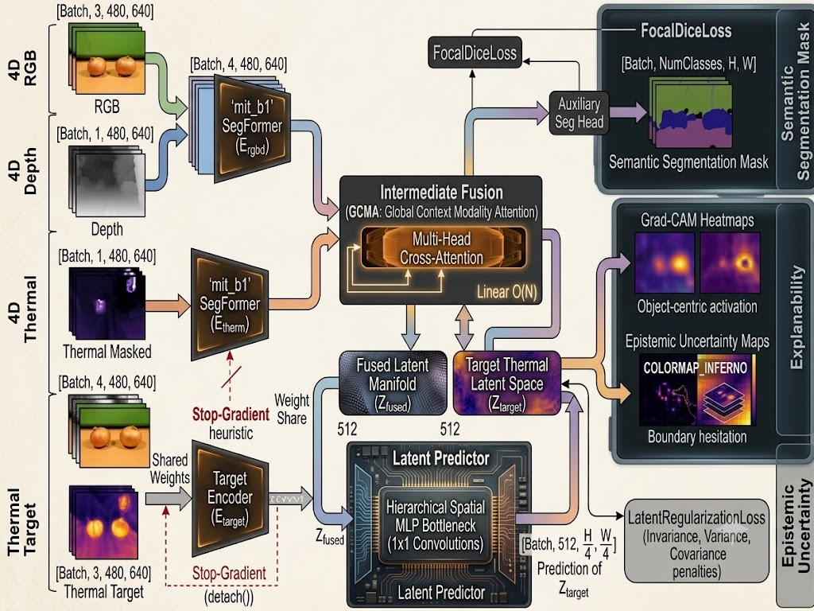
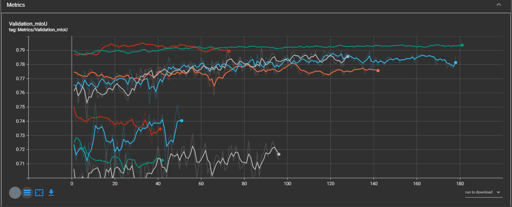
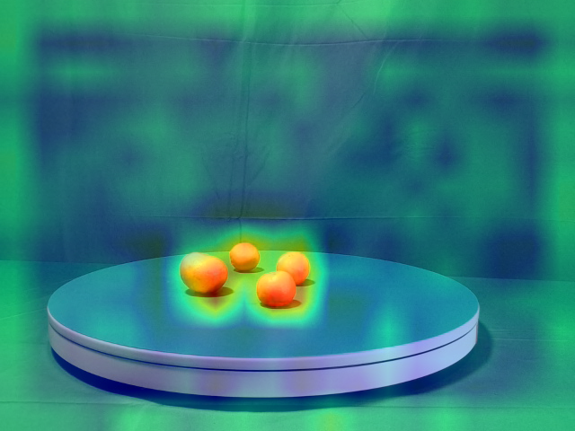
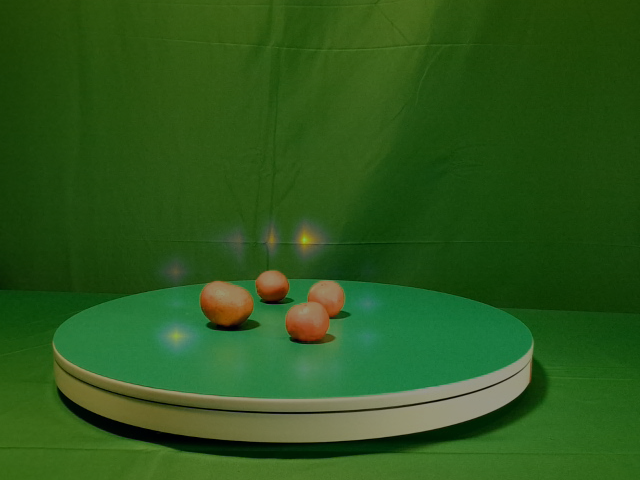

# TriModal Perception Architectures for Structural Defect Detection: Generative vs. Latent Predictive Networks

Abstract
Structural defect detection in complex industrial and agricultural environments requires robust multimodal integration. In this repository, we document the evolution of two distinct spatial perception engines for RGB, Depth, and Thermal sensors built upon a 4-channel patched mit_b1 Vision Transformer backbone. Part I details the legacy TriModal Predictive Network (TMPN), utilizing a pixel-space generative approach to hallucinate obscured thermodynamics. Part II introduces the TriModal Latent Predictive Network (TMLPN), which abandons pixel generation entirely. By adapting the Joint-Embedding Predictive Architecture (JEPA) paradigm to a static spatial domain and regulating 512-channel embeddings via a strict Variance-Covariance (VICReg) penalty, the architecture successfully traverses domain manifolds to predict structural physics with vastly improved sample efficiency and resilience to stochastic noise.

---

## 1. Introduction

The detection of structural defects utilizing high-resolution sensors (e.g., Baumer GigE industrial cameras synchronized with thermal units) poses a unique cross-modal alignment challenge. Early iterations of this architecture utilized generative pixel-space decoders to hallucinate missing thermal data. However, reconstructing pixel-space physics forces the network to map irrelevant high-frequency noise and sensor grain, frequently leading to "Background Collapse." To address this, we transitioned to Latent Space Prediction, building upon recent advancements in self-supervised Joint-Embedding Predictive Architectures.

---

## 2. Core Repository Structure

This repository is strictly for deploying the O(N) TriModal Latent Predictive Network (TMLPN). All legacy artifacts have been isolated in the `deprecated/` directory.

RGBDT-Predictive/

├── assets/                 
├── dataset.py              
├── models.py              
├── pyproject.toml        
├── README.md               
├── train.py                
└── uv.lock                 

---

## PART I: The Legacy Tri-Objective Generative Network (TMPN)

### 3.1 TMPN Methodology & Architecture

The baseline TMPN architecture addresses cross-modal alignment by forcing the network to hallucinate obscured thermodynamic data back into pixel space.

* Primary Segmentation: A Focal Dice loss evaluating spatial boundaries [3].
* Thermal Reconstruction (Physics Loss): An Object-Aware Block Mask obscures a percentage of the input Thermal tensor. The network's decoder must reconstruct this masked region in pixel-space using a Masked Mean Squared Error (MSE) loss, forcing it to learn structural thermodynamics.
* Global Context Modality Attention (GCMA): To resolve mechanical parallax (Y-axis sensor offset), the GCMA head preserves pristine geometry by treating every individual pixel in the RGB-D feature map as a discrete Query. The globally pooled Thermal and RGB-D signatures act as the Keys and Values [1].

### 3.2 TMPN Quantitative Milestones

The state-machine progression on the MM5 dataset yielded the following quantitative milestones. Test-Time Augmentation (TTA) was utilized during the final diagnostic passes to measure robustness against asymmetric false-positives.

| Training Phase | Objective / Mechanism | Final Base mIoU | Final TTA mIoU |
| :--- | :--- | :--- | :--- |
| Baseline | Warmup; ImageNet patched weights [2] | 0.7434 | 0.7341 |
| HPO | 30-Trial Optuna sweep. Best peak mIoU: 0.7504 | - | - |
| Hero | Deep convergence (Patience @ Epoch 93) | 0.7453 | 0.7383 |
| Microtune | Cooling schedule + TTA Polish | 0.7488 | 0.7391 |

(Note: TMPN represents the absolute mathematical ceiling for the pixel-space generative approach. To eliminate the computational overhead of rendering stochastic sensor noise, the pipeline transitions to Latent Space Prediction in Part II).

---

## PART II: The TriModal Latent Predictive Network (TMLPN)

## 4. Introduction to Latent Prediction

While the generative TMPN architecture successfully aligned multimodal features, pixel-space reconstruction is inherently inefficient. The network expends massive computational capacity hallucinating high-frequency thermal "speckle" and ambient heat bleed—artifacts that are irrelevant to the actual physical structure of a defect. Part II introduces the TMLPN, shifting the paradigm from pixel generation to latent feature prediction. By operating entirely in an abstract manifold, the architecture achieves immunity to stochastic noise and accelerates domain traversal.

## 5. Mathematical Mapping to the JEPA Framework

> 
> Figure 1: Comprehensive pipeline of the TriModal Latent Predictive Network, detailing the intermediate-fusion topology, the hierarchical spatial MLP predictor, and the VICReg regularization engine.
The TMLPN formally adapts the Joint-Embedding Predictive Architecture (JEPA) [5] for cross-modal structural evaluation. To ensure rigorous adherence to the theoretical framework, the architecture is defined by the following strict topological mappings:

* The Context (x): The observable information the model is permitted to evaluate. In TMLPN, this is the pristine RGB-D geometry tensor combined with an artificially masked Thermal tensor.
* The Target (y): The uncorrupted physical ground truth the model is attempting to predict. In TMLPN, this is the pristine, unmasked Thermal tensor.
* The Context Encoder (E_θ): The composite network responsible for processing the observable world. In TMLPN, this comprises the mit_b1 RGB-D encoder, the Thermal encoder processing the masked input, and the Global Context Modality Attention (GCMA) fusion head that binds them.
* The Target Encoder (E_target): The network that generates the "ground truth" latent signature. In TMLPN, this is the isolated Thermal encoder processing the unmasked target tensor, governed by a strict .detach() operation to lock the weights during prediction.
* The Predictor (P_φ): The neural module that infers the Target embedding based solely on the Context embedding. In TMLPN, this is the latent_predictor operating via a hierarchical convolutional bottleneck.

### 6.1 The Latent Regularization Engine (The VICReg Triad)

Because the Target Encoder is locked via a Stop-Gradient, the network must be physically restrained from Representation Collapse. TMLPN adapts the VICReg framework [6] via three constraints:

* Similarity Loss (Invariance): The primary MSE objective. Forces the prediction of the Context Encoder to match the Target Encoder's output.
* Variance Loss (Anti-Collapse): A hinge loss enforcing standard deviation ≥ 1.0 across the predicted latent batch, preventing points from collapsing into a singularity.
* Covariance Loss (The Decorrelator): Penalizes off-diagonal elements in the covariance matrix, forcing all 512 channels of the backbone to learn unique, orthogonal features [6].

$$L_{cov} = \frac{1}{C} \sum_{i \neq j} \left( \frac{Z_i^T Z_j}{N-1} \right)^2$$

---

## 7. Results & Analysis

### 7.1 Baseline Training Dynamics & Pathologies

During the unoptimized 150-epoch baseline run, the architecture exhibited expected self-supervised mathematical behaviors, notably a massive discrepancy between Total Training Loss (~40.0) and Validation Loss (~0.14). Because latent target generation is strictly an auxiliary training task [5], the Validation loop correctly bypassed the VICReg penalties to strictly evaluate the downstream segmentation cross-entropy error.

Furthermore, early epochs demonstrated a sharp spike in Covariance (peaking at ~42.0 around Epoch 23). This is a known pathology in high-capacity architectures attempting to satisfy VICReg Variance constraints by duplicating features across channels (Dimensional Redundancy) [6]. By aggressively weighting the covariance penalty (`cov_weight = 15.0`), the network was forced to decorrelate its 512 channels, stabilizing the manifold.

> 
> Figure 2: Telemetry of the TMLPN Baseline Run. The top-left chart captures the exact moment the network hit the sledgehammer Covariance penalty (Epoch 23), successfully forcing the channels into orthogonal representations.

> 
> Figure 3: Optuna Parallel Coordinate Plot demonstrating convergence on an aggressive masking ratio of 42.7% during the HPO phase.

### 7.2 Deep Convergence & The Microtune Polish

Following a 30-trial Bayesian optimization sweep (using Optuna as shown in Figure 3), the architecture achieved deep convergence during a long-horizon Hero phase. To finalize spatial boundaries, a Microtune phase shifted the learning rate into a microscopic 10⁻⁵ to 10⁻⁷ cooling schedule, anchoring the latent space.

To determine the architectural limits of the MM5 dataset, the training pipeline was executed sequentially across the entire mit Vision Transformer series, from the shallow `mit_b1` through the heavy `mit_b5`.

 #### Hero Phase: Global Convergence
 | Architecture | Parameters | Base Validation mIoU | TTA Validation mIoU |
 | :--- | :--- | :--- | :--- |
 | mit_b1 | 13.7M | 0.7311 | 0.7262 |
 | mit_b2 | 24.2M | 0.7531 | 0.7473 |
 | mit_b3 | 44.0M | 0.7923 | 0.7851 |
 | mit_b4 | 60.8M | 0.7896 | 0.7969 |
 | mit_b5 | 81.4M | 0.7829 | 0.7870 |

 #### Microtune Phase: Spatial Boundary Refinement
 | Architecture | Parameters | Base Validation mIoU | TTA Validation mIoU |
 | :--- | :--- | :--- | :--- |
 | mit_b1 | 13.7M | 0.7301 | 0.7265 |
 | mit_b2 | 24.2M | 0.7501 | 0.7444 |
 | mit_b3 | 44.0M | 0.7946 | 0.7866 |
 | mit_b4 | 60.8M | 0.7960 | 0.8014 |
 | mit_b5 | 81.4M | 0.7827 | 0.7865 |

> 
> Figure 4: mIoU of the TMLPN Hero and Microtune Phases. The microscopic learning rate gently cools the Covariance and Total Train Loss (top) while the Validation mIoU (bottom) remains highly stable.

 ### 7.3 Discussion: Scaling and Multi-Modal Behaviors

 The empirical results across the hierarchical transformer scales reveal critical insights into multi-modal representation learning:

 1. The Capacity Saturation Point
 Scaling from the lightweight `mit_b1` up to `mit_b5` exposes a clear performance ceiling within the MM5 dataset. The network achieves its absolute peak performance at the `mit_b4` scale following the Microtune phase (0.8014 TTA mIoU). Pushing the architecture further to `mit_b5` (81.4M parameters) results in a quantifiable regression, dropping back down to 0.7865. This indicates a saturation point where the dataset complexity can no longer support the massive parameter count, leading to mild overfitting or unmanageable exponential variance across the 40+ deeper transformer blocks.

 2. The TTA Inversion Phenomenon
 The telemetry reveals a fascinating behavioral inversion regarding Test-Time Augmentation (TTA). For the lighter architectures (`mit_b1`, `mit_b2`, and `mit_b3`), applying TTA consistently lowers the mIoU. These shallower networks lack the capacity to confidently resolve the spatial hesitation introduced by geometric flipping, resulting in epistemic uncertainty. Conversely, the deeper `mit_b4` and `mit_b5` architectures experience a performance boost from TTA. Their highly parameterized multi-head self-attention mechanisms successfully synthesize the flipped orientations into a more robust, confident consensus prediction.

 3. The Microtune Refinement Margin
 The impact of the Microtune phase—using highly decayed learning rates and Dynamic Class-Weighting (DCW)—is heavily dependent on the backbone's starting capacity. For smaller models (`mit_b1`, `mit_b2`), forcing the network to heavily penalize minority class failures slightly destabilized the global representations, causing a negligible drop in overall mIoU. However, the high-capacity `mit_b3` and `mit_b4` models successfully absorbed the DCW penalty, utilizing their deeper feature maps to refine spatial boundaries and push the total mIoU higher.

### 7.4 Explainability: Tightening Spatial Boundaries

Semantic Grad-CAM and Epistemic Uncertainty mapping applied to identical input geometry at the conclusion of the Microtune run demonstrate razor-sharp, object-centric hotspots.

> 
>
> Figure 5: The Grad-CAM heatmap reveals object-centric hotspots that strictly adhere to physical mass. 

>  
>
> Figure 6: The Epistemic Uncertainty map captures the model's spatial hesitation during Test-Time Augmentation (TTA).

### 7.5 Interpreting the Uncertainty Maps: Grid Artifacts & Boundary Hesitation

The Epistemic Uncertainty map evaluates cross-modal agreement and spatial confidence by measuring the prediction variance across multiple TTA orientations. The visual artifacts rendered on these maps are highly indicative of the underlying Vision Transformer mechanics:

1. The "Waffle" Pattern: The faint grid structure visible across the heatmap traces the rigid 4x4 patch grid of the mit_b1 backbone. As TTA horizontally and vertically flips the input, the physical features are forced into different patch alignments, causing sub-pixel variance that mathematically highlights the Transformer's internal grid.
2. Glowing Object Boundaries: Epistemic uncertainty naturally peaks at the transition points between classes. The intense "halos" hugging the perimeters of defects indicate that the model is highly confident about the interior of the defect, but is hesitating on the microscopic classification of the boundary line during TTA flips.
3. Corner Flares (Spatial Quantization Error): Bright flares appearing strictly at the 4-way intersections of the patch grid indicate Spatial Quantization Error. The network is fragmenting its attention across four distinct patch tokens to understand a microscopic physical feature (or high-frequency sensor noise), causing the variance to spike at those exact coordinates.

---

## 8. Architectural Trade-Offs & Theoretical Defenses

### 8.1 Intermediate vs. Early Fusion Topology
A common theoretical critique of multimodal perception engines is the assumption of "early-fusion," where heterogeneous sensors (RGB, Depth, Thermal) are concatenated into a single backbone input. Naive early-fusion ignores the distinct statistical variances of each modality, resulting in catastrophic feature dilution.

TMLPN explicitly avoids this by utilizing an intermediate-fusion topology. The RGB-D and Thermal domains are processed by completely isolated Vision Transformer encoders. Before the feature maps are permitted to interact in the GCMA head, they pass through independent normalization streams, applying dedicated 1×1 convolutions and 2D Batch Normalization to explicitly balance the statistical variance.

### 8.2 The O(N) vs. O(N²) Cross-Attention Bottleneck
In the GCMA fusion head, the Thermal Keys and Values are globally pooled before cross-attention is calculated against the RGB-D spatial Queries.

Preserving the full spatial dimensions of the Keys and Values introduces a quadratic O(N²) computational complexity to the cross-attention matrix. On shared-memory edge Linux SoCs, pushing massive attention matrices through the memory bus saturates bandwidth long before GPU ALU limits are reached. By globally pooling the context, TMLPN reduces the mathematical complexity of fusion to linear time O(N). This calculated trade-off sacrifices microscopic thermal localization to guarantee blazing-fast inference speeds (30+ FPS) and inherent immunity to mechanical sensor parallax.

### 8.3 GCMA Context Pooling vs. Latent Perceiver Blocks
Theoretical optimizations often suggest substituting standard attention with a DeepMind Perceiver block to solve the O(N²) bottleneck. A standard Perceiver achieves linear time by introducing an asymmetrical array of "Latent Tokens" to query the raw sensor space.

However, utilizing a Perceiver block outputs a flattened 1D array of latent tokens, fundamentally destroying the rigid 2D geometric grid established by the SegFormer backbone. The GCMA head solves the exact same computational bottleneck but from the opposite mathematical direction. By preserving the high-resolution RGB-D spatial grid as the Queries and pooling the context as the Keys/Values, the GCMA achieves O(N) runtime while flawlessly preserving the 2D spatial dimensions, allowing the network to retain the sub-pixel boundary mapping required for structural segmentation.

### 8.4 Stop-Gradient Heuristics and Explicit Covariance Regularization
Many self-supervised frameworks utilize an Exponential Moving Average (EMA) teacher network to prevent representation collapse in the target encoder. TMLPN abandons the EMA framework entirely, utilizing identical shared weights for the Context and Target encoders governed solely by a strict Stop-Gradient (.detach()) operation.

By explicitly enforcing the VICReg constraints [6], TMLPN proves that mathematically regularizing the variance and covariance of the embedding manifold physically prevents rank collapse. Excision of the EMA teacher network significantly reduces VRAM consumption during training without sacrificing manifold stability.

### 8.5 Mitigating Imbalance and Asymptotic Limits (DCW & KD)
Industrial defect datasets exhibit extreme class imbalance. To overcome this without unbalancing the VICReg latent space, TMLPN utilizes a Dynamic Class-Weighting Schedule (DCW) [7]. By tracking an Exponential Moving Average (EMA) of the validation IoU for each class, the downstream Dice penalty is exponentially scaled on the fly specifically for lagging minority classes:

$$W_c = EMA( W_c, e^[τ * (1 - IoU_c)] )$$ 

To break representational capacity ceilings, the pipeline integrates a Knowledge Distillation (KD) engine [9]. By forcing the lightweight Student to minimize the Kullback-Leibler (KL) Divergence against a massive 82M-parameter Teacher's soft probabilities ("Dark Knowledge"), the edge-deployed model inherits advanced stochastic noise suppression while perfectly retaining its 14M-parameter high-speed footprint.

$$L_{KD} = \tau^2 \text{KL}\left( \sigma\left(\frac{z_{student}}{\tau}\right) \parallel \sigma\left(\frac{z_{teacher}}{\tau}\right) \right)$$

---

## 9. Key Concepts & Technical Glossary

For researchers and engineers adapting this repository, the architecture relies heavily on the following foundational concepts:

* Joint-Embedding Predictive Architectures (JEPA): A self-supervised paradigm that forces a Context Encoder and a Target Encoder to align their outputs in an abstract latent space, abandoning generative pixel reconstruction. (Meta AI: I-JEPA)
* VICReg (Variance-Invariance-Covariance): The mathematical regularization triad used to physically stabilize the latent manifold without an EMA teacher network, preventing representation collapse. (VICReg Paper)
* Hierarchical Vision Transformers (SegFormer): The underlying architecture of the modality-isolated encoders, utilizing an overlap-patching mechanism to process high-resolution geometry without losing 2D grid structure. (SegFormer Paper)
* Spatial MLPs (1x1 Convolutions): The parameter-efficient operation powering the predictor bottleneck. It executes a Multi-Layer Perceptron point-wise across the channel depth, preserving geometric boundaries. (Network in Network)
* Linear-Time Cross-Attention: The mechanism within the GCMA head that reduces architectural complexity from a crippling O(N²) to a highly efficient O(N) by globally pooling the context. (Attention Is All You Need)
* Knowledge Distillation (KL Divergence): The model compression strategy used to transfer the complex inter-class similarities of a massive workstation model into a lightweight edge-deployable footprint. (Distilling Knowledge)
* Test-Time Augmentation (TTA) Uncertainty: The mathematical evaluation of spatial hesitation and out-of-distribution (OOD) anomalies by measuring prediction variance across augmented orientations. (Bayesian Deep Learning Uncertainties)
* ONNX Opset 18: The required graph compilation protocol that natively preserves dynamic tensor operations (like spatial pooling axes) for clean TensorRT transitions. (ONNX Concepts)

---

## 10. Conclusion & Edge Deployment

 By abandoning pixel-space generation, the TriModal Latent Predictive Network establishes a vastly more efficient methodology for multimodal defect detection. The empirical scaling behavior dictates a highly specific deployment strategy to balance maximum predictive fidelity against strict edge hardware constraints.

 The `mit_b4` architecture represents the undeniable peak of this pipeline. Achieving over 80% mIoU, it serves as the ultimate offline "Teacher" network, perfectly capturing complex non-linear thermal manifolds from RGB-D inputs. However, its 60.8M parameter mass is too intensive for real-time robotic inference.

 To achieve true edge autonomy, we utilize the lightweight `mit_b1` backbone (13.7M parameters) as the active "Student." Utilizing Knowledge Distillation, we transfer the inter-class dark knowledge from the `mit_b4` Teacher down into the `mit_b1` framework. For isolated industrial deployment, this optimized asymmetric graph is serialized to an ONNX artifact (opset_version=18). By deploying this distilled TensorRT engine onto a Jetson Orin Nano functioning as a companion computer aboard a UAV or rover, the system achieves sub-pixel structural segmentation and real-time autonomous thermal predictions directly at the sensor source.

---

## References

[1] Vaswani, A., et al. (2017). Attention Is All You Need. NeurIPS.

[2] Xie, E., et al. (2021). SegFormer: Simple and Efficient Design for Semantic Segmentation with Transformers. NeurIPS.

[3] Sudre, C. H., et al. (2017). Generalised Dice overlap as a deep learning loss function for highly unbalanced segmentations. DLMIA.

[4] Maes, L., et al. (2024). LeWorldModel: Stable End-to-End Joint-Embedding Predictive Architecture from Pixels. arXiv preprint.

[5] Assran, M., et al. (2023). Self-Supervised Learning from Images with a Joint-Embedding Predictive Architecture. CVPR.

[6] Bardes, A., Ponce, J., & LeCun, Y. (2022). VICReg: Variance-Invariance-Covariance Regularization for Self-Supervised Learning. ICLR.

[7] Huang, Y., et al. (2020). Dynamic Weighting for Imbalanced Semantic Segmentation.

[8] Lin, M., Chen, Q., & Yan, S. (2013). Network In Network. ICLR.

[9] Hinton, G., Vinyals, O., & Dean, J. (2015). Distilling the Knowledge in a Neural Network. NIPS Deep Learning Workshop.

---

## 🙏 Acknowledgments & Citations

This project would not be possible without the MM5 Dataset. We sincerely thank the original creators and authors for their foundational work in multi-modal data collection, hardware synchronization, and curation, which enabled the training and evaluation of this architecture.

If you utilize this pipeline, the underlying architecture, or the data, please cite the primary publication alongside the dataset repository:

Primary Publication:
> Brenner, M., Reyes, N. H., Susnjak, T., & Barczak, A. L. C. (2026). MM5: Multimodal image capture and dataset generation for RGB, depth, thermal, UV, and NIR. Information Fusion, 126, 103516.
> DOI: https:doi.org/10.1016/j.inffus.2025.103516

Dataset:
> Brenner, M., Reyes, N., Susnjak, T., & Barczak, A. (2025). MM5: Multimodal Image Dataset. figshare. Dataset.
> DOI: https:doi.org/10.6084/m9.figshare.28722164
